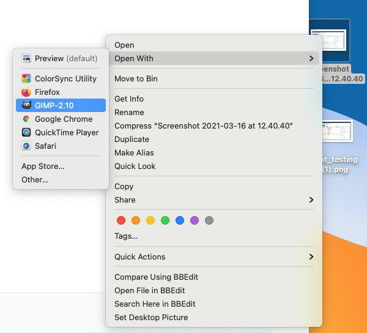
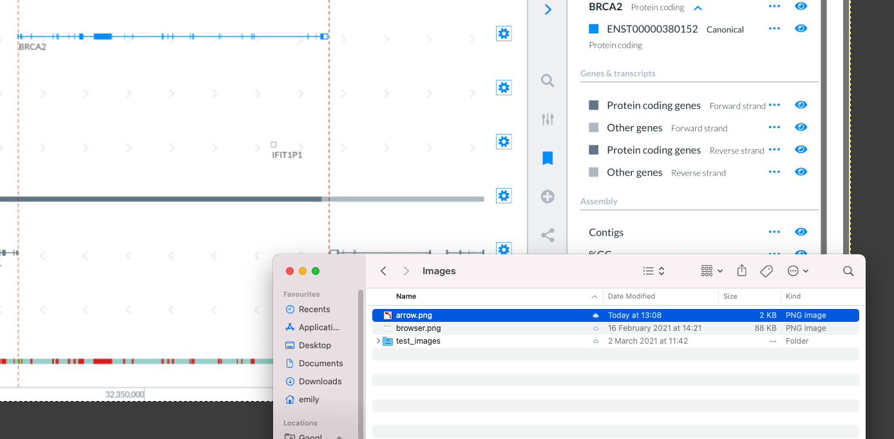
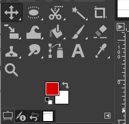
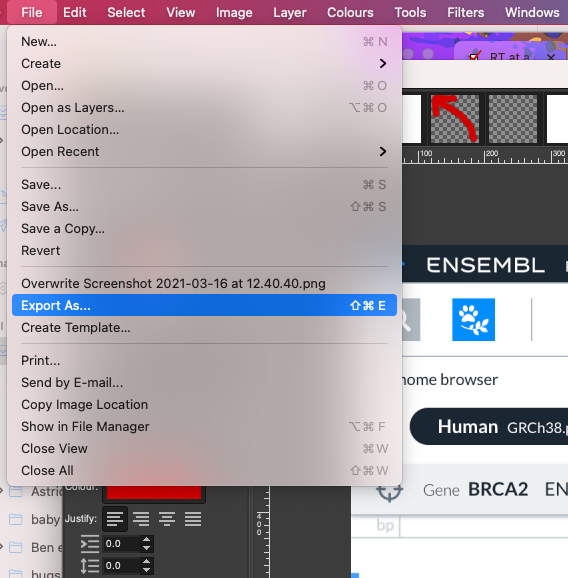

# Images for the docs

## Screenshots

To take images of a whole page, scale your browser to 1200 px wide (you may need to turn on developer tools to see the size of the page) on your laptop retina display screen and take a screenshot.

Open in gimp.

Drop the arrow.png image into the screenshot wherever you want to add a label – flip/rotate to the orientation you need it at.

Add text labels in Caveat bold 100px #D90000 (rgb 217,0,0).

The tools for Gimp are at the top left, you will mainly need to Move and text tools.

Gimp works with layers, which are listed on the right.

Save the Gimp file to the Outreach shared drive image folder so that it can be edited in future. Export the image as png.

Drop the file into tinypng to compress. Download the image again and add to Git.

## Drawings

## Links
[Tinypng](https://tinypng.com/) for shrinking file size without losing quality

[GIMP](https://www.gimp.org/) for drawing

[Images Google Drive folder](https://drive.google.com/drive/folders/1-6m7xzXevV45AiQjeZLLuOQRlAzFgJrF?usp=sharing) for saving Gimp files
