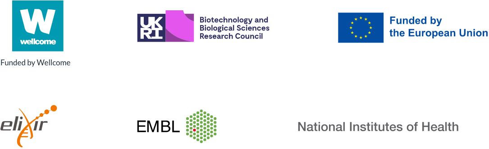

# Funding

Ensembl receives majority funding from Wellcome [222155/Z/20/Z0] with additional funding for specific project components provided by the National Human Genome Research Institute under Award Numbers [U24HG007234; U41HG007823; R01HG010485; U41HG010972], National Institute of Allergy and Infectious Diseases under award number [75N93019C00077] of the National Institutes of Health; the Biotechnology and Biological Sciences Research Council [BB/P016855/1; BB/W019108/1; BB/T015608/1]; the European Union under the Horizon2020 [825575; 817998; 817923; 815668] and the Horizon Europe [101059492; 101094718] funding programmes; Wellcome [226458/Z/22/Z ]; ELIXIR, the research infrastructure for life-science data, and the European Molecular Biology Laboratory core funds.

