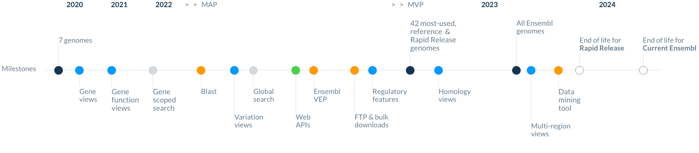

# Ensembl Roadmap

We are currently implementing a widespread refresh of the Ensembl infrastructure, which includes launching the new Ensembl website. The timeline for launching the new website is running in parallel with updates to other aspects of the Ensembl infrastructure. 

These updates ensure:
- Genome annotation and analysis is provided at ever increasing scales. 
- Improved website user experience.
- Provision of a comprehensive suite of methods to access Ensembl hosted annotation in standard formats.

## Website and tools
Our new website is being delivered in three phases of development: 

1. Minimal Acceptable Product (MAP) will be delivered in Q1 2022 and provided genome browsing, viewing attributes of key entities, search and help.
2. Minimal Viable Product (MVP), currently scheduled for Q3 2022, will provide equivalent functionality to the Ensembl Rapid Release site, including variation visualisations, homologies and support for all new genomes. The Ensembl Rapid Release site is scheduled for retirement in 2023.
3. New website functionality reaches that of the current site by the end of 2023. The current Ensembl sites will then receive minimal updates and are scheduled to be archived in late 2024.

## Other Infrastructure Updates 
The Ensembl Perl API and publicly hosted MySQL databases currently provide programmatic access to genome annotation, but will be replaced with web-based APIs. A public beta version of our GraphQL entity API will be made available in early 2022, with other APIs launched during 2022 and 2023. The timeline for the retirement of our existing Perl API and public MySQL is dependent on providing access to all data freely hosted in Ensembl and will not start until data is accessible via other mechanisms.
 
We are also developing new methods for locating flat-file dumps of Ensembl data programmatically rather than relying on FTP alone. Flat-files will continue to remain accessible from our bulk download services.

During the development period of our new infrastructure, access to existing services will not be retired unless, for most use-cases, there is an equivalent service or tool available on our new infrastructure. However all existing services will be retired eventually and archived for 5 years, according to our current policy.
