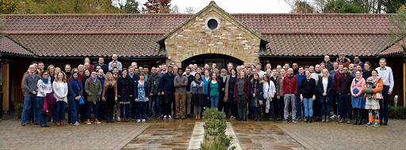

# The Ensembl team

Currently, the Ensembl group consists of over 100 people, divided into a number of smaller teams.

## Annotation

### Genebuild

Responsible for our internal annotation of genomes, including assembly loading, repeat-masking, and gene annotation.

### Variation

Creates infrastructure to manage and annotate genomic variation data and phenotype/disease associations. Develops and maintains tools including VEP, Variant recoder, LD calculator. Projects include Ensembl, IGSR and G2P.

### Regulation

Adapts, develops and runs computational analysis methods to identify and characterise genomic regulatory elements.

### Compara

Integrates our genomic annotation across species by generating gene trees, homologies and alignments.

### Havana

Responsible for manual annotation of genes on a selection of key species, primarily human and mouse.

### Microbes

Responsible for importing annotation of fungal, protist and prokaryotic genomes, and their interactions with each other and their hosts.

### Plants

Responsible for importing community annotation of plant genomes, focusing particularly on crop species such as wheat, rice and barley.

### Metazoa

Responsible for importing community annotation of invertebrate genomes, generation of new genome assemblies and annotations (African Cassava Whitefly, Infravec2),  and providing EBI's contribution to the VEuPathDB eukaryotic pathogen and vector database.

### WormBase/AGR

Responsible for EBI's contribution to a collection of collaborative resources in the area of nematode, flatworm and model organism genomics (WormBase, WormBase ParaSite, The Alliance of Genome Resources)

## Development and support

### Infrastructure

Develops and maintains the core database and associated API, the current [REST API](https://rest.ensembl.org), and eHive.

### Applications

Develops and maintains various projects, including [Tark](http://tark.ensembl.org/) and the [Trackhub Registry](https://www.trackhubregistry.org).

### Production

Responsible for management of data release, execution of pipelines during the release cycle and development of associated software infrastructure.

### Web team

The Backend and Frontend web teams develop and maintain this website and other websites under the ensembl.org domain, as well as the [Ensembl blog](https://www.ensembl.info).

### User research & design

Engages with users to understand their needs and objectives, as well as liaising with the teams in Ensembl to create new interfaces, interactions and experiences when working with Ensembl genomes and data.

### Outreach

Responsible for spreading awareness and education for Ensembl. They also manage the help desk.

