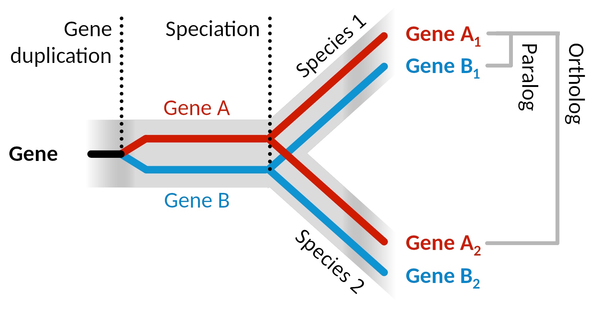
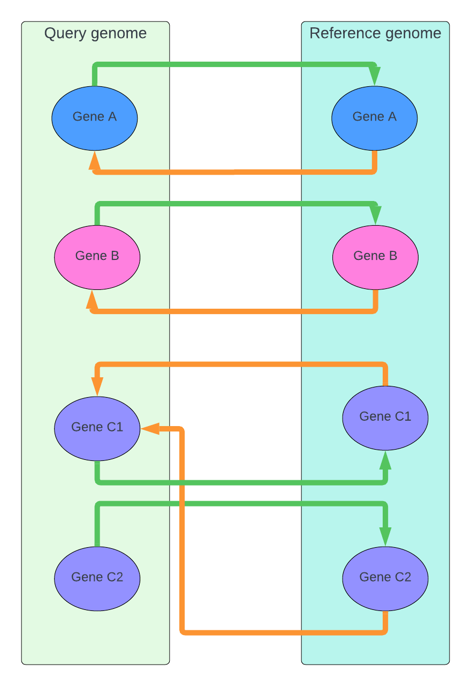

The homology annotation pipeline
================================

Background on homologies
------------------------

<figure>
  
  <figcaption>
  Fig 1. Gene phylogeny as red and blue branches within grey species phylogeny. Modified from  [Wikipedia](https://en.wikipedia.org/wiki/Sequence_
homology#/media/File:Ortholog_paralog_analog_examples.svg) under [CC BY 4.0](https://creativecommons.org/licenses/by/4.0/).
  </figcaption>
</figure>

Understanding the evolutionary relationships between genes is essential for deciphering their functions and histories [1, 2, 3]. Homologous genes share a common ancestor, being separated (“split”) by either a speciation event (giving rise to orthologues, e.g. Gene A1 and Gene A2 in  **Fig 1.**) or a gene duplication event (resulting in paralogues, e.g.  Gene A1 and Gene B1 in **Fig 1.**) [1, 4].
Identifying homologous genes is fundamental to inferring the function of genes in newly sequenced genomes by transferring annotation from better-studied organisms [3, 5].

Homology inference methodology
------------------------------

Homologous genes, due to their common ancestry, demonstrate sequence similarity in their DNA and corresponding gene products. However, they are also different due to the changes accumulated independently since being split by a speciation or gene duplication event (**Fig 1.**). Therefore sequence similarity and homology are different concepts, however, we can make inferences about homology based on the observed sequence similarity [1].

The most fine-grained methods for inferring homology relationships, following an initial grouping into potential homologous sets, considers sequence similarity in the context of a [multiple sequence alignment](https://en.wikipedia.org/wiki/Multiple_sequence_alignment) which is used to build a [gene tree](https://en.wikipedia.org/wiki/Phylogenetic_tree). By comparing the gene tree to the known species phylogeny (a process known as reconciliation) the speciation and duplication nodes are identified and the pairwise orthology and paralogy relationships are inferred [1 ,6]. However, these methods do not scale well with an increasing number of considered genomes.

<figure>
  
  <figcaption>
  Fig 2. Illustration of reciprocal best BLAST hits (RBBH) and best BLAST hits (BBH). The genes from the query genome are searched against the reference genome and the best hits are identified (green arrows). Conversely, the best hits from the reference genome to the query genome are identified (orange arrows). When two genes find each other as the best match in both directions, they are considered reciprocal best BLAST hits (RBBH) and are strong candidates for being orthologs (e.g.query Gene A and reference Gene A). In the absence of reciprocal best hits, the best blast hit(s) can be identified as putative homologs (query Gene C2 and reference Gene C2).
  </figcaption>
</figure>

A more scalable approach for inferring homologies, primarily orthologies, is the reciprocal best BLAST hit (RBBH) strategy [1, 5, 7, 8, 9]. The core idea behind RBBH is that true orthologues (genes separated by speciation) are likely to be the most similar sequence between two different genomes. This is because orthologues tend to have conserved functions subjected to similar evolutionary pressures [2, 3].
Hence, RBBH involves searching a query protein sequence from one genome against another genome and checking if the best hit finds the original query sequence as its best hit when searching back against the original genome (**Fig 2.**) [1, 5, 7, 8, 9].
The RBBH strategy is very stringent and it selects conserved orthologues with a low false positive rate, however, it often fails to detect orthology relationships in the presence of paralogues [5, 10]. If reciprocal best hits are not found for a sequence, defining a more general homology relationship between a query gene and its best BLAST hits (the best BLAST hit - BBH - strategy) can still be valuable.

Technical details
-----------------

To optimise computational efficiency and ensure the most informative genome comparisons, we utilise reference genome collections representing major clades in the tree of life (along with genomes of special interest as outgroups). For each query species, we select the taxonomically closest collection for homology inference or employ a default collection if a more specific one is not found.
The current reference collections are the following (with links to their NCBI taxonomy trees):

- [Actinopterygii](https://itol.embl.de/tree/1722225465338081713949786)
- [Arthropoda](https://itol.embl.de/tree/1722225465354261713949845)
- [Hexapoda](https://itol.embl.de/tree/1722225465378991713949952)
- [Mammalia](https://itol.embl.de/tree/1722225465387561713950008)
- [Metazoa](https://itol.embl.de/tree/1722225465403071713950062)
- [Protostomia](https://itol.embl.de/tree/1722225465415291713950101)
- [Sauropsida](https://itol.embl.de/tree/1722225465437341713950191)
- [Vertebrata](https://itol.embl.de/tree/172222546557211713950590)
- [default](https://itol.embl.de/tree/1722225465372551713949911)

After selecting the appropriate reference collection, the annotation pipeline first runs a BLAST search of the query proteome sequences against the proteins from the reference collection using DIAMOND [11], which has proven to be a good basis for RBBH homology inference [9] by offering a combination of speed and sensitivity that is essential for large-scale analyses. In the second step, the proteins from the reference collection are searched against the query proteome.
The hits from both searches are ranked by alignment features:

- score
- E-value
- percent identity
- percent positive matches
- alignment length

Next,  the top hits for a given query/reference genome pair are identified for each protein in both searches (**Fig 2.**), followed by the identification of sequences that are each other's best hits, thus defining the RBBH orthologues. In the case there are multiple identical hits to proteins in the reference genome, all hits are reported as RBBH.
In the absence of reciprocal best hits, BBH homologies are recorded between the query protein and the set of top hits in the reference genome (**Fig 2.**).
Finally, the homologies based on alignments covering less than 50% of the query and the reference protein are discarded, and the remaining homologies are stored in a database.

References
----------

 1. Altenhoff, A.M., & Dessimoz, C. (2012). “Inferring orthology and paralogy.” in *Evolutionary Genomics: Statistical and Computational Methods, Volume 1*. [PubMed](https://pubmed.ncbi.nlm.nih.gov/22407712/)
 2. Kristensen, D.M., Wolf, Y.I., Mushegian, A.R., & Koonin, E.V. (2011). “Computational methods for Gene Orthology inference.” *Briefings in Bioinformatics*. [PubMed](https://pubmed.ncbi.nlm.nih.gov/21690100/)
 3. Altenhoff AM, Studer RA, Robinson-Rechavi M, Dessimoz C. (2012). "Resolving the ortholog conjecture: orthologs tend to be weakly, but significantly, more similar in function than paralogs." *PLoS Computational Biology*. [PubMed](https://pubmed.ncbi.nlm.nih.gov/22615551/)
 4. Sequence homology. (2024, February 17). In *Wikipedia*. [https://en.wikipedia.org/wiki/Sequence_homology](https://en.wikipedia.org/wiki/Sequence_homology).
 5. Poptsova MS, Gogarten JP. (2007). "BranchClust: a phylogenetic algorithm for selecting gene families." *BMC Bioinformatics*. [PubMed](https://pubmed.ncbi.nlm.nih.gov/17425803/)
 6. Emms DM, Kelly S. (2019). "OrthoFinder: phylogenetic orthology inference for comparative genomics." *Genome Biology*. [PubMed](https://pubmed.ncbi.nlm.nih.gov/31727128/)
 7. Moreno-Hagelsieb G, Latimer K. (2008). "Choosing BLAST options for better detection of orthologs as reciprocal best hits." *Bioinformatics*. [PubMed](https://pubmed.ncbi.nlm.nih.gov/18042555/)
 8. Ward N, Moreno-Hagelsieb G. (2014). "Quickly finding orthologs as reciprocal best hits with BLAT, LAST, and UBLAST: how much do we miss?" *PLoS One*. [PubMed](https://pubmed.ncbi.nlm.nih.gov/25013894/)
 9. Hernández-Salmerón JE, Moreno-Hagelsieb G. (2020). "Progress in quickly finding orthologs as reciprocal best hits: comparing blast, last, diamond and MMseqs2." *BMC Genomics*. [PubMed](https://pubmed.ncbi.nlm.nih.gov/33099302/)
 10. Dalquen DA, Dessimoz C. (2013). "Bidirectional best hits miss many orthologs in duplication-rich clades such as plants and animals." *Genome Biology and Evolution*. [PubMed](https://pubmed.ncbi.nlm.nih.gov/24013106/)
 11. Buchfink B, Reuter K, Drost HG. (2021). "Sensitive protein alignments at tree-of-life scale using DIAMOND." *Nature Methods*. [PubMed](https://pubmed.ncbi.nlm.nih.gov/33828273/)

