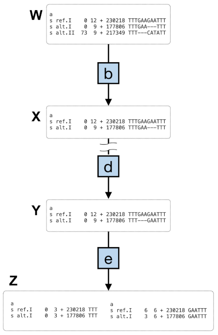

# Genomic alignments in the Alignments viewer

## Genomic alignment datasets

Currently, the Alignments viewer includes [genomic alignment datasets](/help/articles/genomic-alignment-datasets-april-2026)
obtained from the human pangenome graph generated as part of the
[Human Pangenome Reference Consortium data release 2](https://humanpangenome.org/hprc-data-release-2/)
([Liao, W.W., <em>et al.</em> 2023](https://doi.org/10.1038/s41586-023-05896-x)).

Pairwise genomic alignments are have been extracted from the human pangenome graph
and prepared for the Alignments viewer as described in the section that follows.

## Preparing alignments for the viewer

Pairwise genomic alignments are obtained from a Minigraph-Cactus pangenome HAL file
([Armstrong <em>et al.</em> 2020](https://doi.org/10.1038/s41586-020-2871-y);
[Hickey <em>et al.</em> 2023](https://doi.org/10.1038/s41587-023-01793-w)) and prepared as
a bigChain file for presentation alongside structural variants in the Alignments viewer.

<ol style="list-style-type:decimal;">
  <li>
  halStats v2.2 (<a href="https://doi.org/10.1093/bioinformatics/btt128">Hickey <em>et al.</em> 2013</a>)
  is used to fetch chrom-sizes data of the reference genome in order to generate, for each reference sequence,
  coordinates of chunk regions up to 500 kilobases in length.
  </li>

  <li>
  hal2maf v2.2 (<a href="https://doi.org/10.1093/bioinformatics/btt128">Hickey <em>et al.</em> 2013</a>) is used to dump a
  <a href="https://genome.ucsc.edu/FAQ/FAQformat.html#format5">Multiple Alignment Format (MAF)</a> file for each chunk region. Option
  <code>--refGenome</code> is set to the reference haplotype genome, while <code>--targetGenomes</code> is set to the alternative haplotype assembly.
  Other command-line arguments are: <code>--maxBlockLen 48000000 --noAncestors --unique</code>
  </li>

  <li>
    
Each nonempty MAF file is used to prepare a chain file. Figure 1 (below) shows key points in this subworkflow.

    <ol style="list-style-type:lower-latin;">
      <li>
      The MAF file is first processed to remove gap-only and overhang columns,
      and to filter out alignment blocks having only one sequence
      (<a href="https://doi.org/10.1093/bioinformatics/btp163">Cock <em>et al.</em> 2009</a>;
      <a href="https://doi.org/10.1038/s41586-020-2649-2">Harris <em>et al.</em> 2020</a>).
      </li>
      <li>
      taffy <a href="https://github.com/ComparativeGenomicsToolkit/taffy/commit/1329d999948ad4acc10116276fa7a9752a749595">commit 1329d999</a>
      (<a href="https://github.com/ComparativeGenomicsToolkit/taffy">Paten & Hickey 2022</a>)
      is used to sanitise haplotype names in the MAF file,
      mafDuplicateFilter (<a href="https://github.com/dentearl/mafTools/commit/c101dedb2c1c8339bc284e3a16000bc4523f5da3">mafTools commit c101dedb</a>)
      (<a href="https://doi.org/10.1101/gr.174920.114">Earl <em>et al.</em> 2014</a>)
      is used ( with option <code>--keep-first</code> ) to deduplicate the alignment per haplotype,
      and taffy is used again in order to restore the original haplotype names.
      </li>
      <li>
      The deduplicated MAF file is again processed to remove
      alignment blocks/columns with fewer than two sequences
      (<a href="https://doi.org/10.1093/bioinformatics/btp163">Cock <em>et al.</em> 2009</a>;
      <a href="https://doi.org/10.1038/s41586-020-2649-2">Harris <em>et al.</em> 2020</a>).
      </li>
      <li>
      Gaps in the alternative haplotype are left-aligned with respect
      to the reference to improve concordance with normalised variants
      (<a href="https://doi.org/10.1093/bioinformatics/btp163">Cock <em>et al.</em> 2009</a>;
      <a href="https://doi.org/10.1093/bioinformatics/btv112">Tan <em>et al.</em> 2015</a>)
      </li>
      <li>
      MAF blocks are split on gaps so that the final MAF file contains only ungapped alignment blocks
      (<a href="https://doi.org/10.1093/bioinformatics/btp163">Cock <em>et al.</em> 2009</a>).
      </li>
      <li>
      maf-convert, part of LAST 1642 (<a href="https://doi.org/10.1101/gr.113985.110">Kie&lstrok;basa <em>et al.</em> 2011</a>)
      converts the resulting MAF to generate a chain file.
      </li>
    </ol>
  </li>

  <li>
  Nonempty chain files are merged into a single file in order of reference haplotype position.
  </li>

  <li>
  Taking the merged chain file in which the reference haplotype is the target genome
  and the alternative haplotype is the query genome, chainSwap, part of kent v415
  (<a href="https://doi.org/10.1093/nar/gkaf1250">Casper <em>et al.</em> 2026</a>) creates a swapped chain
  file in which the alternative is the target genome and the reference is the query genome.
  </li>

  <li>
  The original and swapped chain files are each converted to a bigChain file. In line with the process described on the
  <a href="https://genome.ucsc.edu/goldenpath/help/bigChain.html">bigChain Track Format</a> UCSC webpage, chainToBigChain,
  part of kent v479 (<a href="https://doi.org/10.1093/nar/gkaf1250">Casper <em>et al.</em> 2026</a>) converts each chain
  file to a pre-bigChain file. With a chrom-sizes file generated for the chain target genome using halStats v2.2
  (<a href="https://doi.org/10.1093/bioinformatics/btt128">Hickey <em>et al.</em> 2013</a>),
  and a bigChain autoSql file (<a href="https://www.linuxjournal.com/article/5949">Kent & Brumbaugh 2002</a>)
  downloaded from the <a href="https://genome.ucsc.edu/goldenpath/help/examples/bigChain.as">UCSC examples page</a>
  (<a href="https://doi.org/10.1093/nar/gkaf1250">Casper <em>et al.</em> 2026</a>), the pre-bigChain file is input to
  bedToBigBed v. 2.8 (<a href="https://doi.org/10.1093/bioinformatics/btq351">Kent <em>et al.</em> 2010</a>) to generate
  an output bigChain file.
  </li>

  <li>
  Finally, validateFiles v4.7 (<a href="https://doi.org/10.1093/nar/gkaf1250">Casper <em>et al.</em> 2026</a>)
  checks each output bigChain file.
  </li>
</ol>

---

<figure>
  
  <figcaption>
  Fig 1. MAF processing subworkflow diagram. The third step of the genomic alignment
  preparation workflow is a subworkflow with several multiple alignment (MAF) processing
  steps. After an initial step <strong>(a)</strong> (not shown) to filter the alignment, some
  alignment blocks may contain multiple alternative sequences as in example alignment
  <strong>W</strong>. Step <strong>(b)</strong> deduplicates the alignment by haplotype assembly,
  so that each alignment block will contain no more than one alternative sequence (as
  in example alignment <strong>X</strong>). Step <strong>(d)</strong> resolves the ambiguous alignment
  of nucleotide sequence &quot;GAA&quot; by left-aligning alternative haplotype gaps, as in example alignment
  <strong>Y</strong>. Step <strong>(e)</strong> splits MAF blocks on gaps to produce ungapped alignment
  blocks (as in example <strong>Z</strong>). Step <strong>(f)</strong> (not shown) converts ungapped MAF
  blocks to chain format.
  </figcaption>
</figure>
