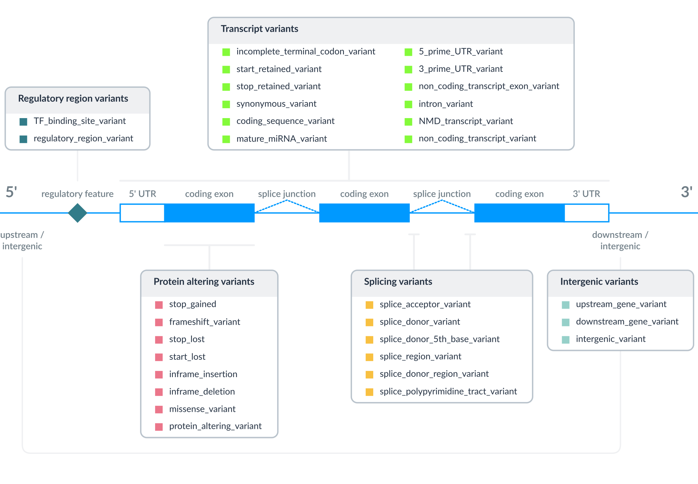

# Ensembl Variation - Calculated Variant Consequences

For each variant that is mapped to the reference genome, we identify overlapping Ensembl transcripts. For human GRCh38, we restrict this to the [GENCODE primary transcript set](https://www.gencodegenes.org/pages/gencode_primary/) which includes all MANE Select, MANE Plus Clinical and Ensembl Canonical transcripts. Next a rule based approach is used to predict the molecular consequence that each alternate allele of the variant has on each transcript it overlaps. The set of consequence terms, defined by the [Sequence Ontology (SO)](http://www.sequenceontology.org/), that can be currently assigned to each combination of an allele and a transcript is shown in the table below. Please note, the same variant allele(s) may have different predicted consequences across alternate transcripts of the same gene, reflecting differences in the transcript structures.

This approach is applied to all germline and somatic variants. The resulting consequence type calls, along with information determined as part of the process, such as the cDNA and CDS coordinates, and the affected codons and amino acids in coding transcripts, are displayed on our website. We also display predicted consequences of variants overlapping regulatory feature where regulatory feature data is available, (e.g. for human, mouse and some livestock and aquaculture species).

## Variant consequnces relative to transcript structure

<figure>
  
</figure>

## Variant consequence terms and Sequence Ontology

The terms in the table below are shown in order of severity (more severe to less severe) as estimated by Ensembl, and this ordering is used on the website summary views. This ordering is necessarily subjective and API and Ensembl VEP users can always get the full set of consequences for each allele and make their own severity judgement. The IMPACT rating is a separate rating given for compatibility with other variant annotation tools (e.g. [snpEff/snpSIFT](http://snpeff.sourceforge.net/)).

<table style="width: 100%; table-layout: fixed; border-collapse: collapse;">
  <colgroup>
    <col style="width: 34%;" />
    <col style="width: 31%;" />
    <col style="width: 14%;" />
    <col style="width: 12%;" />
    <col style="width: 9%;" />
  </colgroup>
  <thead>
    <tr>
      <th style="padding: 8px 12px; vertical-align: top; text-align: left; border-bottom: 1px solid #0099FF;">SO term</th>
      <th style="padding: 8px 12px; vertical-align: top; text-align: left; border-bottom: 1px solid #0099FF;">SO description</th>
      <th style="padding: 8px 22px 8px 12px; vertical-align: top; text-align: left; border-bottom: 1px solid #0099FF;">SO accession</th>
      <th style="padding: 8px 12px 8px 22px; vertical-align: top; text-align: left; border-bottom: 1px solid #0099FF;">Display term</th>
      <th style="padding: 8px 12px; vertical-align: top; text-align: left; border-bottom: 1px solid #0099FF;">IMPACT</th>
    </tr>
  </thead>
  <tbody>
    <tr>
      <td style="padding: 8px 18px 8px 12px; vertical-align: top; white-space: nowrap;"><code style="white-space: nowrap;">splice_acceptor_variant</code></td>
      <td style="padding: 8px 12px; vertical-align: top;">A splice variant that changes the 2 base region at the 3&#x27; end of an intron</td>
      <td style="padding: 8px 22px 8px 12px; vertical-align: top; white-space: nowrap;"><a href="https://www.sequenceontology.org/miso/current_svn/term/SO%3A0001574">SO:0001574</a></td>
      <td style="padding: 8px 12px 8px 22px; vertical-align: top;">Splice acceptor variant</td>
      <td style="padding: 8px 12px; vertical-align: top; white-space: nowrap;">HIGH</td>
    </tr>
    <tr>
      <td style="padding: 8px 18px 8px 12px; vertical-align: top; white-space: nowrap;"><code style="white-space: nowrap;">splice_donor_variant</code></td>
      <td style="padding: 8px 12px; vertical-align: top;">A splice variant that changes the 2 base region at the 5&#x27; end of an intron</td>
      <td style="padding: 8px 22px 8px 12px; vertical-align: top; white-space: nowrap;"><a href="https://www.sequenceontology.org/miso/current_svn/term/SO%3A0001575">SO:0001575</a></td>
      <td style="padding: 8px 12px 8px 22px; vertical-align: top;">Splice donor variant</td>
      <td style="padding: 8px 12px; vertical-align: top; white-space: nowrap;">HIGH</td>
    </tr>
    <tr>
      <td style="padding: 8px 18px 8px 12px; vertical-align: top; white-space: nowrap;"><code style="white-space: nowrap;">stop_gained</code></td>
      <td style="padding: 8px 12px; vertical-align: top;">A sequence variant whereby at least one base of a codon is changed, resulting in a premature stop codon, leading to a shortened transcript</td>
      <td style="padding: 8px 22px 8px 12px; vertical-align: top; white-space: nowrap;"><a href="https://www.sequenceontology.org/miso/current_svn/term/SO%3A0001587">SO:0001587</a></td>
      <td style="padding: 8px 12px 8px 22px; vertical-align: top;">Stop gained</td>
      <td style="padding: 8px 12px; vertical-align: top; white-space: nowrap;">HIGH</td>
    </tr>
    <tr>
      <td style="padding: 8px 18px 8px 12px; vertical-align: top; white-space: nowrap;"><code style="white-space: nowrap;">frameshift_variant</code></td>
      <td style="padding: 8px 12px; vertical-align: top;">A sequence variant which causes a disruption of the translational reading frame, because the number of nucleotides inserted or deleted is not a multiple of three</td>
      <td style="padding: 8px 22px 8px 12px; vertical-align: top; white-space: nowrap;"><a href="https://www.sequenceontology.org/miso/current_svn/term/SO%3A0001589">SO:0001589</a></td>
      <td style="padding: 8px 12px 8px 22px; vertical-align: top;">Frameshift variant</td>
      <td style="padding: 8px 12px; vertical-align: top; white-space: nowrap;">HIGH</td>
    </tr>
    <tr>
      <td style="padding: 8px 18px 8px 12px; vertical-align: top; white-space: nowrap;"><code style="white-space: nowrap;">stop_lost</code></td>
      <td style="padding: 8px 12px; vertical-align: top;">A sequence variant where at least one base of the terminator codon (stop) is changed, resulting in an elongated transcript</td>
      <td style="padding: 8px 22px 8px 12px; vertical-align: top; white-space: nowrap;"><a href="https://www.sequenceontology.org/miso/current_svn/term/SO%3A0001578">SO:0001578</a></td>
      <td style="padding: 8px 12px 8px 22px; vertical-align: top;">Stop lost</td>
      <td style="padding: 8px 12px; vertical-align: top; white-space: nowrap;">HIGH</td>
    </tr>
    <tr>
      <td style="padding: 8px 18px 8px 12px; vertical-align: top; white-space: nowrap;"><code style="white-space: nowrap;">start_lost</code></td>
      <td style="padding: 8px 12px; vertical-align: top;">A codon variant that changes at least one base of the canonical start codon</td>
      <td style="padding: 8px 22px 8px 12px; vertical-align: top; white-space: nowrap;"><a href="https://www.sequenceontology.org/miso/current_svn/term/SO%3A0002012">SO:0002012</a></td>
      <td style="padding: 8px 12px 8px 22px; vertical-align: top;">Start lost</td>
      <td style="padding: 8px 12px; vertical-align: top; white-space: nowrap;">HIGH</td>
    </tr>
    <tr>
      <td style="padding: 8px 18px 8px 12px; vertical-align: top; white-space: nowrap;"><code style="white-space: nowrap;">inframe_insertion</code></td>
      <td style="padding: 8px 12px; vertical-align: top;">An inframe non synonymous variant that inserts bases into in the coding sequence</td>
      <td style="padding: 8px 22px 8px 12px; vertical-align: top; white-space: nowrap;"><a href="https://www.sequenceontology.org/miso/current_svn/term/SO%3A0001821">SO:0001821</a></td>
      <td style="padding: 8px 12px 8px 22px; vertical-align: top;">Inframe insertion</td>
      <td style="padding: 8px 12px; vertical-align: top; white-space: nowrap;">MODERATE</td>
    </tr>
    <tr>
      <td style="padding: 8px 18px 8px 12px; vertical-align: top; white-space: nowrap;"><code style="white-space: nowrap;">inframe_deletion</code></td>
      <td style="padding: 8px 12px; vertical-align: top;">An inframe non synonymous variant that deletes bases from the coding sequence</td>
      <td style="padding: 8px 22px 8px 12px; vertical-align: top; white-space: nowrap;"><a href="https://www.sequenceontology.org/miso/current_svn/term/SO%3A0001822">SO:0001822</a></td>
      <td style="padding: 8px 12px 8px 22px; vertical-align: top;">Inframe deletion</td>
      <td style="padding: 8px 12px; vertical-align: top; white-space: nowrap;">MODERATE</td>
    </tr>
    <tr>
      <td style="padding: 8px 18px 8px 12px; vertical-align: top; white-space: nowrap;"><code style="white-space: nowrap;">missense_variant</code></td>
      <td style="padding: 8px 12px; vertical-align: top;">A sequence_variant, that changes one or more bases, resulting in a different amino acid sequence but where the length is preserved</td>
      <td style="padding: 8px 22px 8px 12px; vertical-align: top; white-space: nowrap;"><a href="https://www.sequenceontology.org/miso/current_svn/term/SO%3A0001583">SO:0001583</a></td>
      <td style="padding: 8px 12px 8px 22px; vertical-align: top;">Missense variant</td>
      <td style="padding: 8px 12px; vertical-align: top; white-space: nowrap;">MODERATE</td>
    </tr>
    <tr>
      <td style="padding: 8px 18px 8px 12px; vertical-align: top; white-space: nowrap;"><code style="white-space: nowrap;">protein_altering_variant</code></td>
      <td style="padding: 8px 12px; vertical-align: top;">A sequence_variant which is predicted to change the protein encoded in the coding sequence</td>
      <td style="padding: 8px 22px 8px 12px; vertical-align: top; white-space: nowrap;"><a href="https://www.sequenceontology.org/miso/current_svn/term/SO%3A0001818">SO:0001818</a></td>
      <td style="padding: 8px 12px 8px 22px; vertical-align: top;">Protein altering variant</td>
      <td style="padding: 8px 12px; vertical-align: top; white-space: nowrap;">MODERATE</td>
    </tr>
    <tr>
      <td style="padding: 8px 18px 8px 12px; vertical-align: top; white-space: nowrap;"><code style="white-space: nowrap;">splice_donor_5th_base_variant</code></td>
      <td style="padding: 8px 12px; vertical-align: top;">A sequence variant that causes a change at the 5th base pair after the start of the intron in the orientation of the transcript</td>
      <td style="padding: 8px 22px 8px 12px; vertical-align: top; white-space: nowrap;"><a href="https://www.sequenceontology.org/miso/current_svn/term/SO%3A0001787">SO:0001787</a></td>
      <td style="padding: 8px 12px 8px 22px; vertical-align: top;">Splice donor 5th base variant</td>
      <td style="padding: 8px 12px; vertical-align: top; white-space: nowrap;">LOW</td>
    </tr>
    <tr>
      <td style="padding: 8px 18px 8px 12px; vertical-align: top; white-space: nowrap;"><code style="white-space: nowrap;">splice_region_variant</code></td>
      <td style="padding: 8px 12px; vertical-align: top;">A sequence variant in which a change has occurred within the region of the splice site, either within 1-3 bases of the exon or 3-8 bases of the intron</td>
      <td style="padding: 8px 22px 8px 12px; vertical-align: top; white-space: nowrap;"><a href="https://www.sequenceontology.org/miso/current_svn/term/SO%3A0001630">SO:0001630</a></td>
      <td style="padding: 8px 12px 8px 22px; vertical-align: top;">Splice region variant</td>
      <td style="padding: 8px 12px; vertical-align: top; white-space: nowrap;">LOW</td>
    </tr>
    <tr>
      <td style="padding: 8px 18px 8px 12px; vertical-align: top; white-space: nowrap;"><code style="white-space: nowrap;">splice_donor_region_variant</code></td>
      <td style="padding: 8px 12px; vertical-align: top;">A sequence variant that falls in the region between the 3rd and 6th base after splice junction (5&#x27; end of intron)</td>
      <td style="padding: 8px 22px 8px 12px; vertical-align: top; white-space: nowrap;"><a href="https://www.sequenceontology.org/miso/current_svn/term/SO%3A0002170">SO:0002170</a></td>
      <td style="padding: 8px 12px 8px 22px; vertical-align: top;">Splice donor region variant</td>
      <td style="padding: 8px 12px; vertical-align: top; white-space: nowrap;">LOW</td>
    </tr>
    <tr>
      <td style="padding: 8px 18px 8px 12px; vertical-align: top; white-space: nowrap;"><code style="white-space: nowrap;">splice_polypyrimidine_tract_variant</code></td>
      <td style="padding: 8px 12px; vertical-align: top;">A sequence variant that falls in the polypyrimidine tract at 3&#x27; end of intron between 17 and 3 bases from the end (acceptor -3 to acceptor -17)</td>
      <td style="padding: 8px 22px 8px 12px; vertical-align: top; white-space: nowrap;"><a href="https://www.sequenceontology.org/miso/current_svn/term/SO%3A0002169">SO:0002169</a></td>
      <td style="padding: 8px 12px 8px 22px; vertical-align: top;">Splice polypyrimidine tract variant</td>
      <td style="padding: 8px 12px; vertical-align: top; white-space: nowrap;">LOW</td>
    </tr>
    <tr>
      <td style="padding: 8px 18px 8px 12px; vertical-align: top; white-space: nowrap;"><code style="white-space: nowrap;">incomplete_terminal_codon_variant</code></td>
      <td style="padding: 8px 12px; vertical-align: top;">A sequence variant where at least one base of the final codon of an incompletely annotated transcript is changed</td>
      <td style="padding: 8px 22px 8px 12px; vertical-align: top; white-space: nowrap;"><a href="https://www.sequenceontology.org/miso/current_svn/term/SO%3A0001626">SO:0001626</a></td>
      <td style="padding: 8px 12px 8px 22px; vertical-align: top;">Incomplete terminal codon variant</td>
      <td style="padding: 8px 12px; vertical-align: top; white-space: nowrap;">LOW</td>
    </tr>
    <tr>
      <td style="padding: 8px 18px 8px 12px; vertical-align: top; white-space: nowrap;"><code style="white-space: nowrap;">start_retained_variant</code></td>
      <td style="padding: 8px 12px; vertical-align: top;">A sequence variant where at least one base in the start codon is changed, but the start remains</td>
      <td style="padding: 8px 22px 8px 12px; vertical-align: top; white-space: nowrap;"><a href="https://www.sequenceontology.org/miso/current_svn/term/SO%3A0002019">SO:0002019</a></td>
      <td style="padding: 8px 12px 8px 22px; vertical-align: top;">Start retained variant</td>
      <td style="padding: 8px 12px; vertical-align: top; white-space: nowrap;">LOW</td>
    </tr>
    <tr>
      <td style="padding: 8px 18px 8px 12px; vertical-align: top; white-space: nowrap;"><code style="white-space: nowrap;">stop_retained_variant</code></td>
      <td style="padding: 8px 12px; vertical-align: top;">A sequence variant where at least one base in the terminator codon is changed, but the terminator remains</td>
      <td style="padding: 8px 22px 8px 12px; vertical-align: top; white-space: nowrap;"><a href="https://www.sequenceontology.org/miso/current_svn/term/SO%3A0001567">SO:0001567</a></td>
      <td style="padding: 8px 12px 8px 22px; vertical-align: top;">Stop retained variant</td>
      <td style="padding: 8px 12px; vertical-align: top; white-space: nowrap;">LOW</td>
    </tr>
    <tr>
      <td style="padding: 8px 18px 8px 12px; vertical-align: top; white-space: nowrap;"><code style="white-space: nowrap;">synonymous_variant</code></td>
      <td style="padding: 8px 12px; vertical-align: top;">A sequence variant where there is no resulting change to the encoded amino acid</td>
      <td style="padding: 8px 22px 8px 12px; vertical-align: top; white-space: nowrap;"><a href="https://www.sequenceontology.org/miso/current_svn/term/SO%3A0001819">SO:0001819</a></td>
      <td style="padding: 8px 12px 8px 22px; vertical-align: top;">Synonymous variant</td>
      <td style="padding: 8px 12px; vertical-align: top; white-space: nowrap;">LOW</td>
    </tr>
    <tr>
      <td style="padding: 8px 18px 8px 12px; vertical-align: top; white-space: nowrap;"><code style="white-space: nowrap;">coding_sequence_variant</code></td>
      <td style="padding: 8px 12px; vertical-align: top;">A sequence variant that changes the coding sequence</td>
      <td style="padding: 8px 22px 8px 12px; vertical-align: top; white-space: nowrap;"><a href="https://www.sequenceontology.org/miso/current_svn/term/SO%3A0001580">SO:0001580</a></td>
      <td style="padding: 8px 12px 8px 22px; vertical-align: top;">Coding sequence variant</td>
      <td style="padding: 8px 12px; vertical-align: top; white-space: nowrap;">MODIFIER</td>
    </tr>
    <tr>
      <td style="padding: 8px 18px 8px 12px; vertical-align: top; white-space: nowrap;"><code style="white-space: nowrap;">mature_miRNA_variant</code></td>
      <td style="padding: 8px 12px; vertical-align: top;">A transcript variant located with the sequence of the mature miRNA</td>
      <td style="padding: 8px 22px 8px 12px; vertical-align: top; white-space: nowrap;"><a href="https://www.sequenceontology.org/miso/current_svn/term/SO%3A0001620">SO:0001620</a></td>
      <td style="padding: 8px 12px 8px 22px; vertical-align: top;">Mature miRNA variant</td>
      <td style="padding: 8px 12px; vertical-align: top; white-space: nowrap;">MODIFIER</td>
    </tr>
    <tr>
      <td style="padding: 8px 18px 8px 12px; vertical-align: top; white-space: nowrap;"><code style="white-space: nowrap;">5_prime_UTR_variant</code></td>
      <td style="padding: 8px 12px; vertical-align: top;">A UTR variant of the 5&#x27; UTR</td>
      <td style="padding: 8px 22px 8px 12px; vertical-align: top; white-space: nowrap;"><a href="https://www.sequenceontology.org/miso/current_svn/term/SO%3A0001623">SO:0001623</a></td>
      <td style="padding: 8px 12px 8px 22px; vertical-align: top;">5 prime UTR variant</td>
      <td style="padding: 8px 12px; vertical-align: top; white-space: nowrap;">MODIFIER</td>
    </tr>
    <tr>
      <td style="padding: 8px 18px 8px 12px; vertical-align: top; white-space: nowrap;"><code style="white-space: nowrap;">3_prime_UTR_variant</code></td>
      <td style="padding: 8px 12px; vertical-align: top;">A UTR variant of the 3&#x27; UTR</td>
      <td style="padding: 8px 22px 8px 12px; vertical-align: top; white-space: nowrap;"><a href="https://www.sequenceontology.org/miso/current_svn/term/SO%3A0001624">SO:0001624</a></td>
      <td style="padding: 8px 12px 8px 22px; vertical-align: top;">3 prime UTR variant</td>
      <td style="padding: 8px 12px; vertical-align: top; white-space: nowrap;">MODIFIER</td>
    </tr>
    <tr>
      <td style="padding: 8px 18px 8px 12px; vertical-align: top; white-space: nowrap;"><code style="white-space: nowrap;">non_coding_transcript_exon_variant</code></td>
      <td style="padding: 8px 12px; vertical-align: top;">A sequence variant that changes non-coding exon sequence in a non-coding transcript</td>
      <td style="padding: 8px 22px 8px 12px; vertical-align: top; white-space: nowrap;"><a href="https://www.sequenceontology.org/miso/current_svn/term/SO%3A0001792">SO:0001792</a></td>
      <td style="padding: 8px 12px 8px 22px; vertical-align: top;">Non coding transcript exon variant</td>
      <td style="padding: 8px 12px; vertical-align: top; white-space: nowrap;">MODIFIER</td>
    </tr>
    <tr>
      <td style="padding: 8px 18px 8px 12px; vertical-align: top; white-space: nowrap;"><code style="white-space: nowrap;">intron_variant</code></td>
      <td style="padding: 8px 12px; vertical-align: top;">A transcript variant occurring within an intron</td>
      <td style="padding: 8px 22px 8px 12px; vertical-align: top; white-space: nowrap;"><a href="https://www.sequenceontology.org/miso/current_svn/term/SO%3A0001627">SO:0001627</a></td>
      <td style="padding: 8px 12px 8px 22px; vertical-align: top;">Intron variant</td>
      <td style="padding: 8px 12px; vertical-align: top; white-space: nowrap;">MODIFIER</td>
    </tr>
    <tr>
      <td style="padding: 8px 18px 8px 12px; vertical-align: top; white-space: nowrap;"><code style="white-space: nowrap;">NMD_transcript_variant</code></td>
      <td style="padding: 8px 12px; vertical-align: top;">A variant in a transcript that is the target of NMD</td>
      <td style="padding: 8px 22px 8px 12px; vertical-align: top; white-space: nowrap;"><a href="https://www.sequenceontology.org/miso/current_svn/term/SO%3A0001621">SO:0001621</a></td>
      <td style="padding: 8px 12px 8px 22px; vertical-align: top;">NMD transcript variant</td>
      <td style="padding: 8px 12px; vertical-align: top; white-space: nowrap;">MODIFIER</td>
    </tr>
    <tr>
      <td style="padding: 8px 18px 8px 12px; vertical-align: top; white-space: nowrap;"><code style="white-space: nowrap;">non_coding_transcript_variant</code></td>
      <td style="padding: 8px 12px; vertical-align: top;">A transcript variant of a non coding RNA gene</td>
      <td style="padding: 8px 22px 8px 12px; vertical-align: top; white-space: nowrap;"><a href="https://www.sequenceontology.org/miso/current_svn/term/SO%3A0001619">SO:0001619</a></td>
      <td style="padding: 8px 12px 8px 22px; vertical-align: top;">Non coding transcript variant</td>
      <td style="padding: 8px 12px; vertical-align: top; white-space: nowrap;">MODIFIER</td>
    </tr>
    <tr>
      <td style="padding: 8px 18px 8px 12px; vertical-align: top; white-space: nowrap;"><code style="white-space: nowrap;">upstream_gene_variant</code></td>
      <td style="padding: 8px 12px; vertical-align: top;">A sequence variant located 5&#x27; of a gene</td>
      <td style="padding: 8px 22px 8px 12px; vertical-align: top; white-space: nowrap;"><a href="https://www.sequenceontology.org/miso/current_svn/term/SO%3A0001631">SO:0001631</a></td>
      <td style="padding: 8px 12px 8px 22px; vertical-align: top;">Upstream gene variant</td>
      <td style="padding: 8px 12px; vertical-align: top; white-space: nowrap;">MODIFIER</td>
    </tr>
    <tr>
      <td style="padding: 8px 18px 8px 12px; vertical-align: top; white-space: nowrap;"><code style="white-space: nowrap;">downstream_gene_variant</code></td>
      <td style="padding: 8px 12px; vertical-align: top;">A sequence variant located 3&#x27; of a gene</td>
      <td style="padding: 8px 22px 8px 12px; vertical-align: top; white-space: nowrap;"><a href="https://www.sequenceontology.org/miso/current_svn/term/SO%3A0001632">SO:0001632</a></td>
      <td style="padding: 8px 12px 8px 22px; vertical-align: top;">Downstream gene variant</td>
      <td style="padding: 8px 12px; vertical-align: top; white-space: nowrap;">MODIFIER</td>
    </tr>
    <tr>
      <td style="padding: 8px 18px 8px 12px; vertical-align: top; white-space: nowrap;"><code style="white-space: nowrap;">TF_binding_site_variant</code></td>
      <td style="padding: 8px 12px; vertical-align: top;">A sequence variant located within a transcription factor binding site</td>
      <td style="padding: 8px 22px 8px 12px; vertical-align: top; white-space: nowrap;"><a href="https://www.sequenceontology.org/miso/current_svn/term/SO%3A0001782">SO:0001782</a></td>
      <td style="padding: 8px 12px 8px 22px; vertical-align: top;">TF binding site variant</td>
      <td style="padding: 8px 12px; vertical-align: top; white-space: nowrap;">MODIFIER</td>
    </tr>
    <tr>
      <td style="padding: 8px 18px 8px 12px; vertical-align: top; white-space: nowrap;"><code style="white-space: nowrap;">regulatory_region_variant</code></td>
      <td style="padding: 8px 12px; vertical-align: top;">A sequence variant located within a regulatory region</td>
      <td style="padding: 8px 22px 8px 12px; vertical-align: top; white-space: nowrap;"><a href="https://www.sequenceontology.org/miso/current_svn/term/SO%3A0001566">SO:0001566</a></td>
      <td style="padding: 8px 12px 8px 22px; vertical-align: top;">Regulatory region variant</td>
      <td style="padding: 8px 12px; vertical-align: top; white-space: nowrap;">MODIFIER</td>
    </tr>
    <tr>
      <td style="padding: 8px 18px 8px 12px; vertical-align: top; white-space: nowrap;"><code style="white-space: nowrap;">intergenic_variant</code></td>
      <td style="padding: 8px 12px; vertical-align: top;">A sequence variant located in the intergenic region, between genes</td>
      <td style="padding: 8px 22px 8px 12px; vertical-align: top; white-space: nowrap;"><a href="https://www.sequenceontology.org/miso/current_svn/term/SO%3A0001628">SO:0001628</a></td>
      <td style="padding: 8px 12px 8px 22px; vertical-align: top;">Intergenic variant</td>
      <td style="padding: 8px 12px; vertical-align: top; white-space: nowrap;">MODIFIER</td>
    </tr>
  </tbody>
</table>
