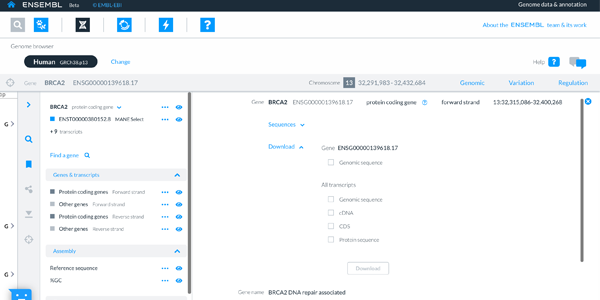

# How to download sequences

You can download gene, cDNA, CDS and peptide sequences from the Genome browser and Entity viewer apps.

In the Genome browser, sequence download is found in the Track drawer.

You can download sequences as a FASTA file which is suitable for using with sequence analysis tools.

In the Entity viewer, you can download the sequence of your transcript of interest by selecting on the interactive transcript and selecting from the download options or by clicking on the download icon on the right hand side of the page.

From both the Genome browser and the Entity viewer you can export sequences of genomic regions, cDNAs, CDSs and peptides.
