# What is the Alignments viewer?

The Alignments viewer allows you to explore genomic variation, including complex structural variants,  between two assemblies. You can compare human reference genomes and a selected number of alternative human haplotypes
## Selecting Genomes to display

To configure the alignment display, begin by selecting the reference genome that you would like to compare alternative genomes to. There are two human references available: the current human reference genome, GRCh38, and the CHM13 telomere to telomere assembly of the human genome (CHM13-T2Tv2).
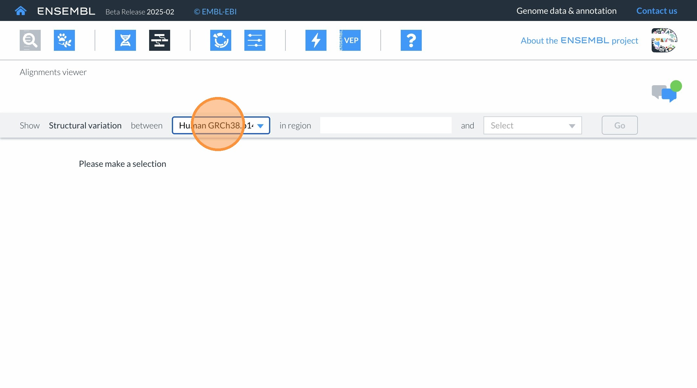

You can specify the genome you would like to compare in the next text box. You can select any region of interest you would like to see, using the format of “chromosome:start-end”.
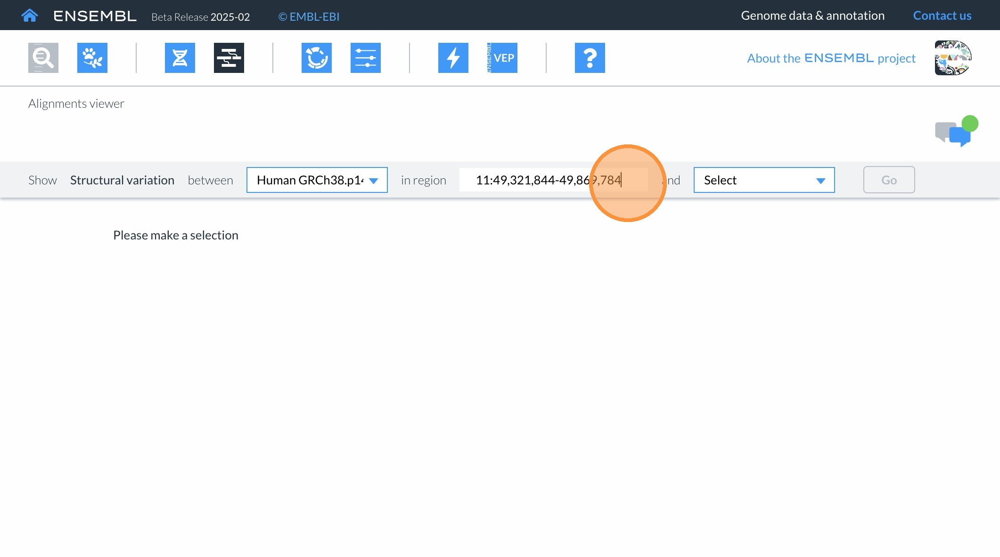

You then select the alternative human haplotype to compare. Once you have configured the reference, the region to display, and an alternative genome, select “Go” to display the alignment.
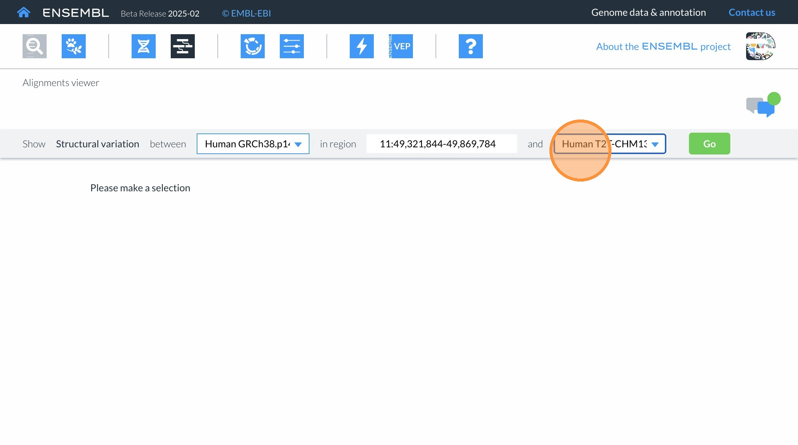

## Tracks in the alignment display
Tracks in the Alignment Viewer display genes for your selected reference and the alternative genome.
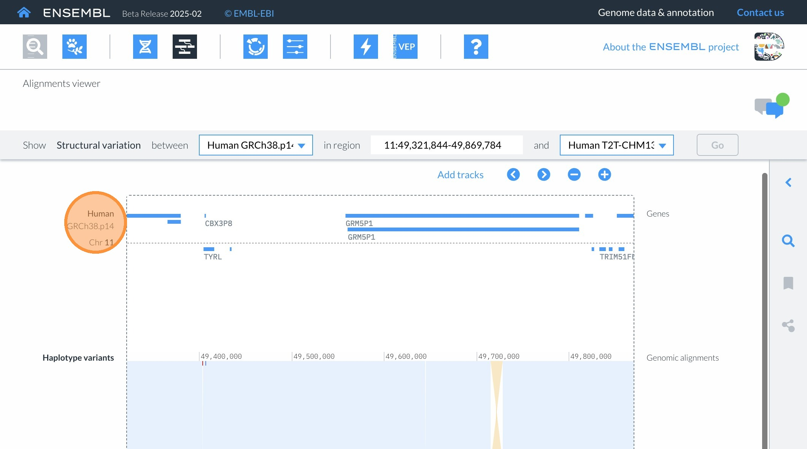

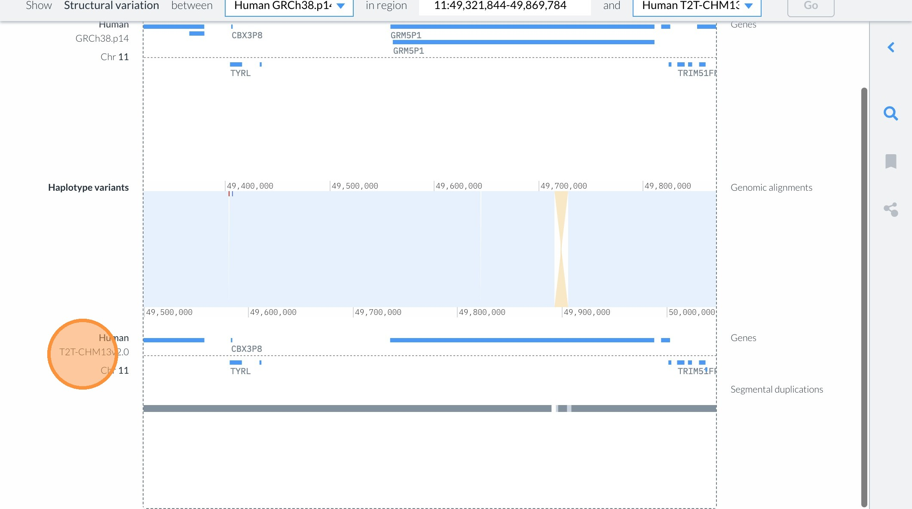

The genomic alignment between the two assemblies is displayed in the centre as coloured blocks. Click the arrow at the top right to open the right hand side panel to display the key for alignment types. Variants called by comparing the 2 assemblies are shown in the ‘Haplotype variants’ track on top of the alignment.
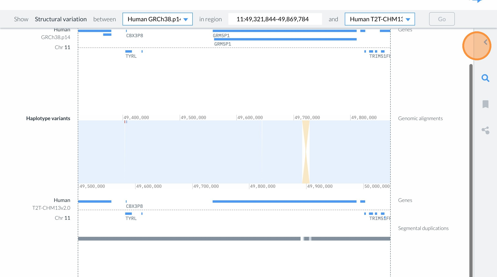

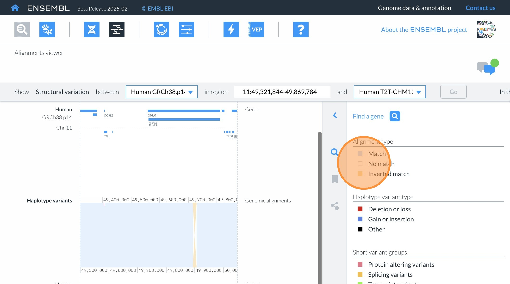

## Navigating in the genome alignment
You can scroll the alignment display up and down by using the scroll bar on the right hand side. You can also move the alignment left and right by clicking the corresponding arrow above the display itself. It is also possible to click the genes and drag the view for any selected genome, or to scroll both genomes left and right by clicking and dragging on the “Genomic Alignment” component in the middle. 
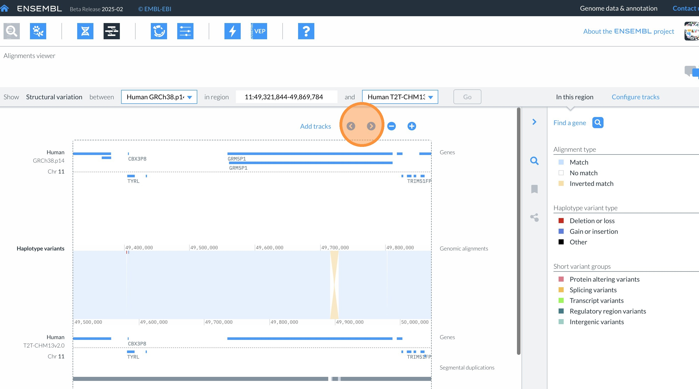

You can zoom the display out and in by using the minus "-"  and plus "+" buttons.
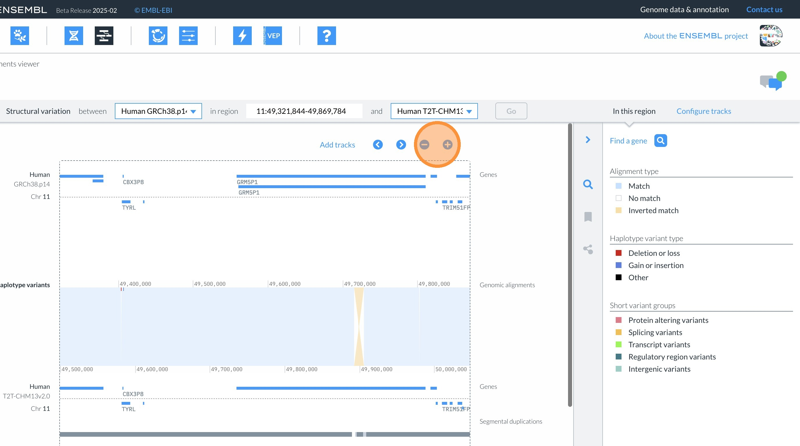

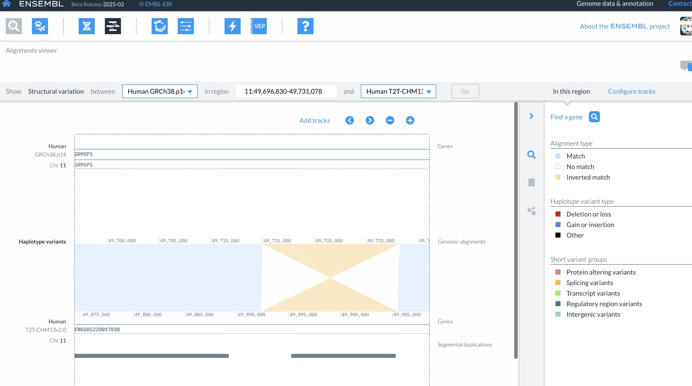

## Adding additional tracks to display. 
Tracks can be added by clicking on "Add tracks" above the display, or by clicking on "Configure tracks" on the right hand side menu.
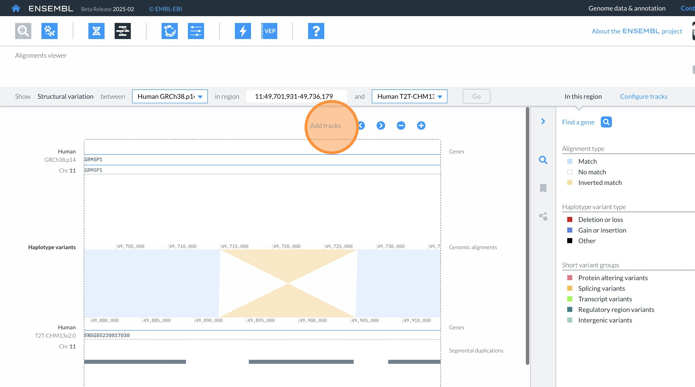

You can enable or disable tracks for the selected reference genome and alternative genome by clicking on the "eye" buttons next to the track name.
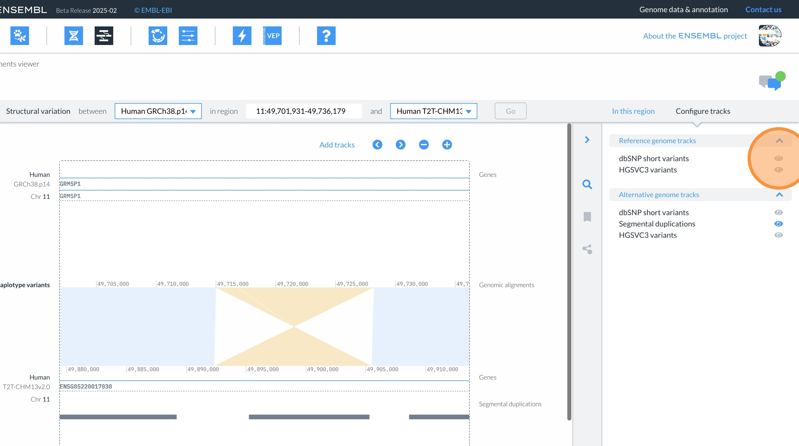

## Feature information
More information about genes, variant or segmental duplications can be accessed by clicking on the figure to open up a pop up box panel.
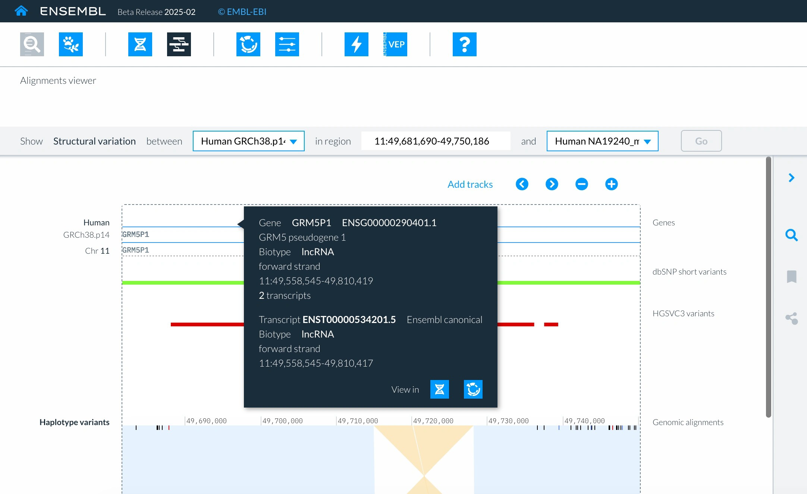

## Searching for genes in the alignment 
To search for genes, click the magnifying glass button, or click "Find a gene" in the right hand side panel.
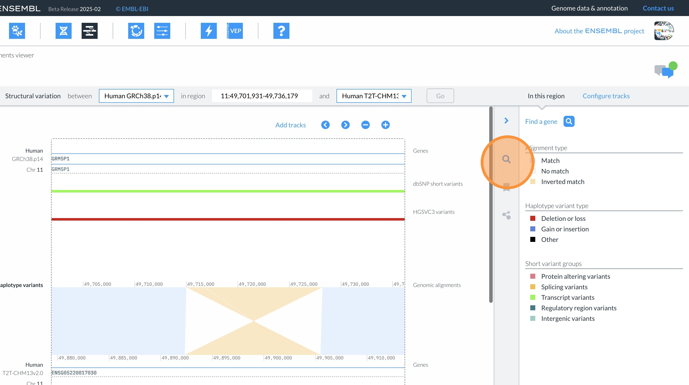

Type the gene name or ID into the search box and click "Go" to search for genes in the reference genome. These can only be seen in the Alignment viewer where an alignment is available between your selected genomes. If available, they will be highlighted in blue. Clicking on a gene result will change the display to center on that gene.
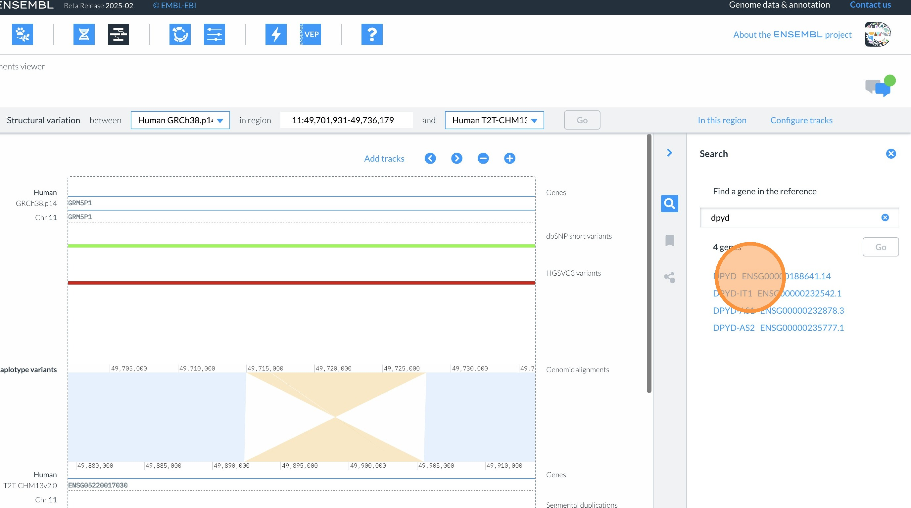

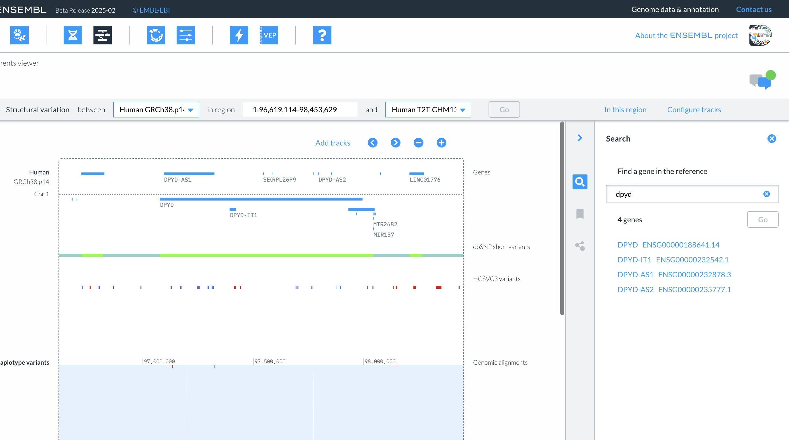

## Regions that cannot be displayed
Not all regions of alternative genomes are available to display depending on the assembly and alignment quality.
If navigating to an unavailable region, you will get a message that states that this particular alignment is not available in that corresponding genome. You can either go back to your previous view or start the configuration again.
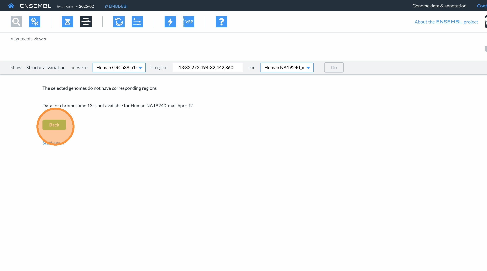

As gene search is only available once the display is enabled, it is best to leave the chromosomal region as default, and then to use the search function to navigate.
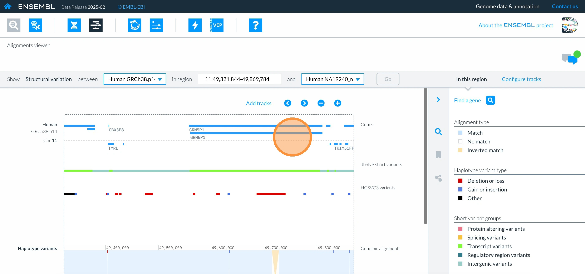

