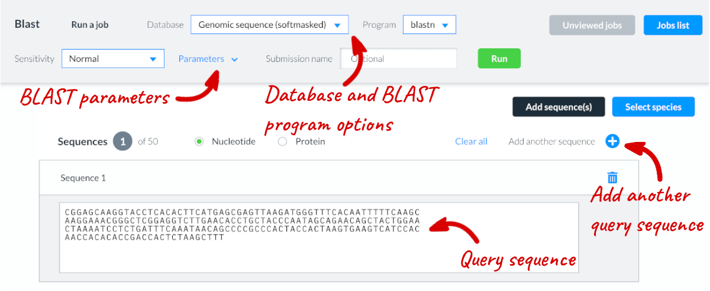
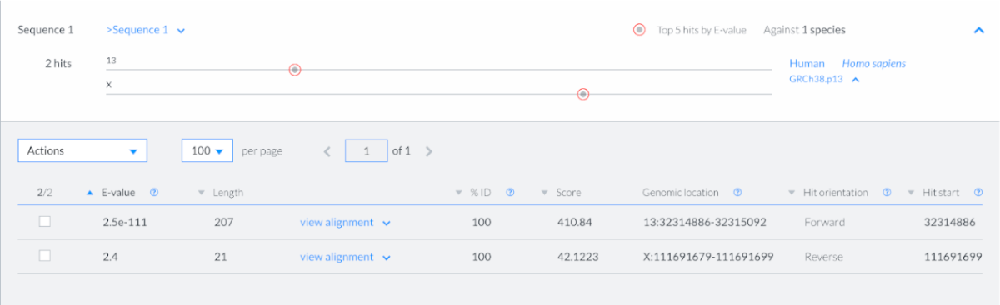

# How to run BLAST

BLAST is a sequence similarity search tool that can be used for both DNA and proteins. 

## Selecting BLAST parameters

The target databases available for similarity searches are DNA, transcripts and proteins. Click on the ‘Database’ dropdown menu and choose from these options. 

The following BLAST programs are available:
BLASTN: nucleotide sequences against nucleotide databases 
TBLASTX: translated nucleotide sequences against a translated nucleotide database

The relevant BLAST program is selected automatically when the target database is selected and the Nucleotide or Protein option is selected above the sequence text box. The BLAST programs have pre-configured parameters, which you can view and change by clicking on the ‘Parameters’ option.

## Entering a query sequence

Paste the query sequence into the text box (the suggested format is FASTA) or upload a sequence file.
 
Up to 50 sequences can be added by clicking on ‘Add another sequence’.

## Select target species

You can select the species you want to run your sequence against by clicking on ‘Select species’ on the right hand side.

## Submitting your BLAST query

You can give a name or description to this BLAST query in the ‘Submission name’ (optional) field. Once your parameters are set, click RUN to start the search.

## What does the result table show

The submissions page will show the jobs that are currently running or recently completed. You have the option to Edit/rerun the job. Results are available for 7 days and queries can be rerun for 28 days.

A submission ID is assigned to each job and additional information is provided, including the date and time of submission. The progression of the job gets automatically refreshed every 10 seconds until the job is fully completed. If you navigate away from the BLAST interface, the status of the query is indicated by the BLAST icon in the top panel changing from red to green to prompt you that it has successfully completed.

You can view the results by clicking on the Results button or you can download the results by clicking on the blue Download icon. 

The results page shows summary results for each sequence submitted with a graphical display of hits on the query sequence. A table of results for each combination of sequences and target database can be found by clicking on the drop down icon next to the species and genome assembly name.

The results table lists the sequence similarity hits in order of E-value, but can be customised to reorder the table based on the different columns by clicking on the arrow next to each column heading. You can customise all rows, or select specific hits, by clicking on the box in the first column of each row.

The table provides information on:
**E-value**: The number of times a match is expected to occur by chance.
**Length**: Length of alignment between query and target sequence.
**Alignment**: You can view alignment between the query sequence and the hit sequence.
**%ID**: Indicates the extent to which the query sequence and the hit have the same residue at the same position in an alignment. 
**Score**: The score gives an indication of how good the alignment is, with a higher score indicating a more exact alignment.
**Genomic location**: Shows the genomic location of the hit in this species
**Hit orientation**: The orientation of the hit against the query sequence
**Hit start**: The position within the target sequence at which the hit started
**Query start**: The first position within the query sequence that matches the beginning of the hit that BLAST returns
**Query end**: The last position within the query sequence that matches the beginning of the hit that BLAST returns

