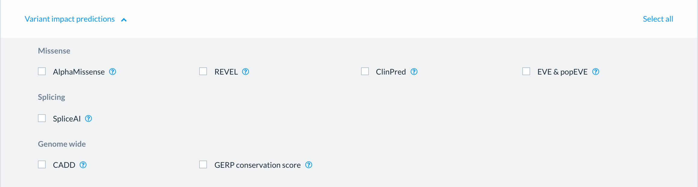
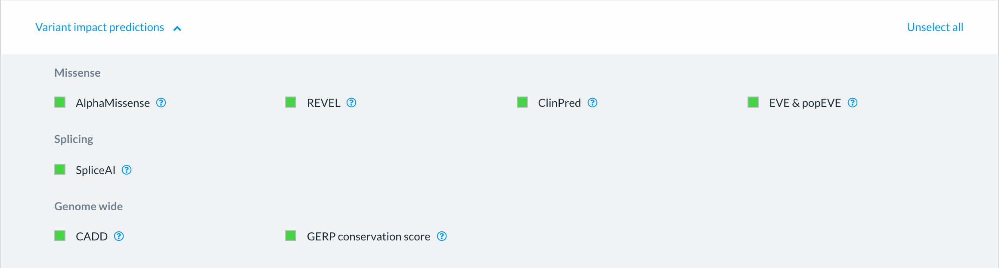
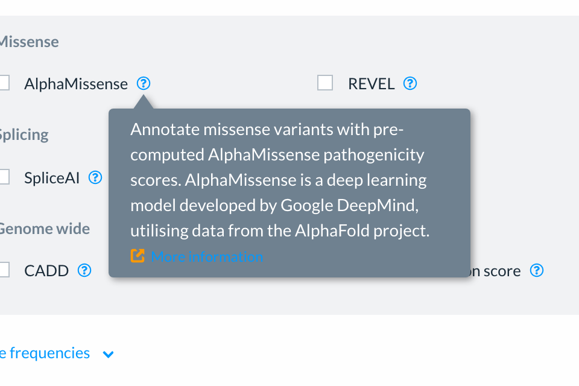
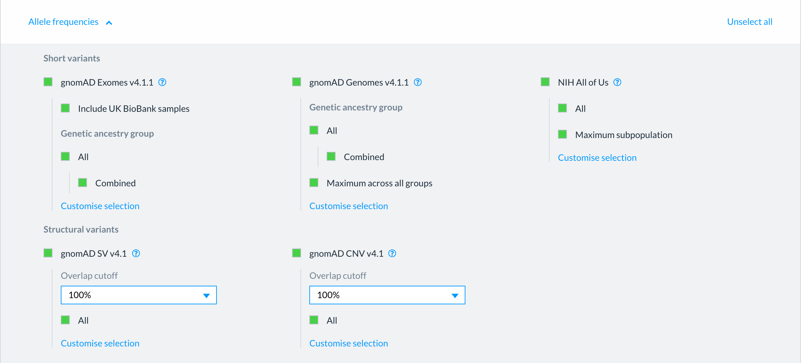

# Choosing what Ensembl VEP annotates

Every Ensembl VEP analysis job tells you which genes and transcripts your variants fall in, and the predicted molecular consequence for each. __Job options__ enable additional variant annotation.

The options appear on the input form once you have added your variants and are grouped into expandable panels.

<figure>
  
  <figcaption>
    The Job options section of the Ensembl VEP input form.
  </figcaption>
</figure>

The options you are offered depend on the genome you chose. Human GRCh38 has the most options; other genomes have fewer, as not every resource covers every species and assembly.

## The panels

### Variant representations

Standard names for your variants: __HGVS__ (at the coding DNA and protein level) and __SPDI__. These are available for all species and assemblies.

### Variant impact predictions

Scores predicting how damaging a variant is likely to be, grouped by what they score:

Scores predicting how damaging a variant is likely to be, grouped by type of impact:

* __Missense:__ predicts how likely an amino acid change is likely to impact protein function 
* __Splicing:__ predicts variant impact on formal splicing 
* __Genome wide:__ predicts tolerance to change across all regions of the genome (primarily SNVs, with some Indels)

### Allele frequencies

How often your variants have been seen in reference populations:

* __Short variants:__ e.g. gnomAD Exomes, gnomAD Genomes, NIH All of Us
* __Structural variants:__ e.g. gnomAD SV, gnomAD CNV

Frequency can be reported over the full population or subsets, as defined by the individual resources.

### Genes & transcripts

* __Locations:__ distance to the nearest transcription start site, nearest gene, nearest exon junction boundary, and how far up or downstream of a transcript a variant may be and still be reported
* __Additional molecular consequence predictions:__ predictions of  likely impact on UTRs, noncanonical open reading frames,  likelihood of NMD escape,  and curated functional information from the Gene Ontology knowledgebase
* __Constraint:__ e.g. pLI, LOEUF and dosage sensitivity, which describe how tolerant a gene is of losing function

### Protein & functional

Options in this section include the Ensembl protein ID and structural and interaction assessments, for example, from __ProtVar__, experimental variant effects from __MaveDB__, molecular interactions from __IntAct__, and predicted disruption of structure, interfaces and motifs from __mutfunc__.

### Regulatory

Overlap with regulatory features, such as a __GENCODE promoter region__.

### Phenotype & disease associations

Phenotypes, diseases and traits associated with your variants and the genes they fall within, collated by Ensembl from sources including ClinVar, OMIM and the GWAS Catalog, together with Geno2MP, Open Targets and ClinVar structural variants.

## Selecting options

Select a panel heading to open it. Tick the options you want.

<figure>
  
  <figcaption>
    The Variant impact predictions panel, showing its options grouped by what they score.
  </figcaption>
</figure>

* __Select all__ turns on every option in the open panel; once they are all on it becomes __Unselect all__.

<figure>
  
  <figcaption>
    A panel with its options selected.
  </figcaption>
</figure>

## Finding out what an option does

Select the question mark beside an option for a short description of what it reports. Where there is a paper or a project site to read, the description links to it.

<figure>
  
  <figcaption>
    The description shown for an option.
  </figcaption>
</figure>

## Options with settings of their own

Some options have additional flexible configuration. Allele frequency sources, for example, can be configured to report a combined frequency, the maximum across all groups, or individual genetic ancestry groups; the overlap required with reference data for structural variant sources can also be precisely specified.

Turning an option on selects its most common settings. Select __Customise selection__ to see the rest, and __Show fewer__ to collapse them again.

<figure>
  
  <figcaption>
    The Allele frequencies panel, with the settings available for each source.
  </figcaption>
</figure>

Everything you choose here is reported in the __Annotations__ column of your results, and is included in the output file you download.