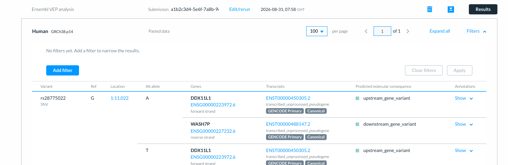
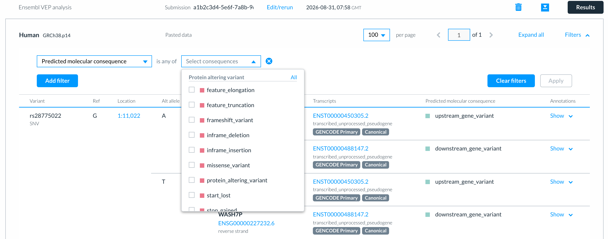
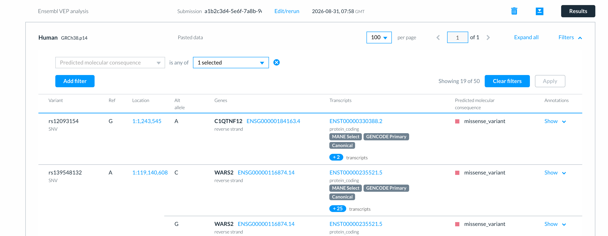
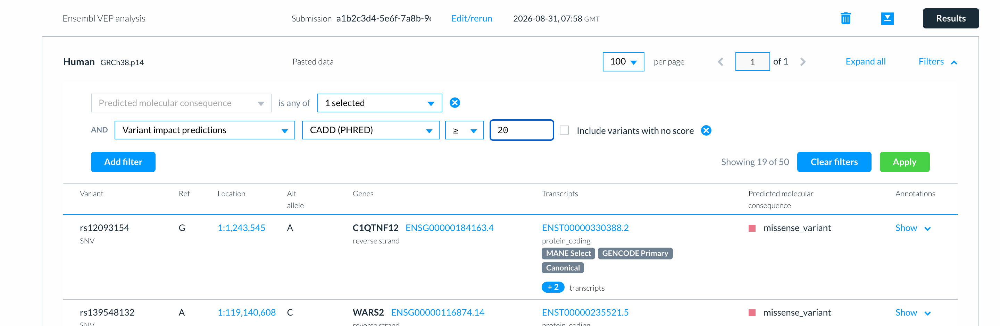
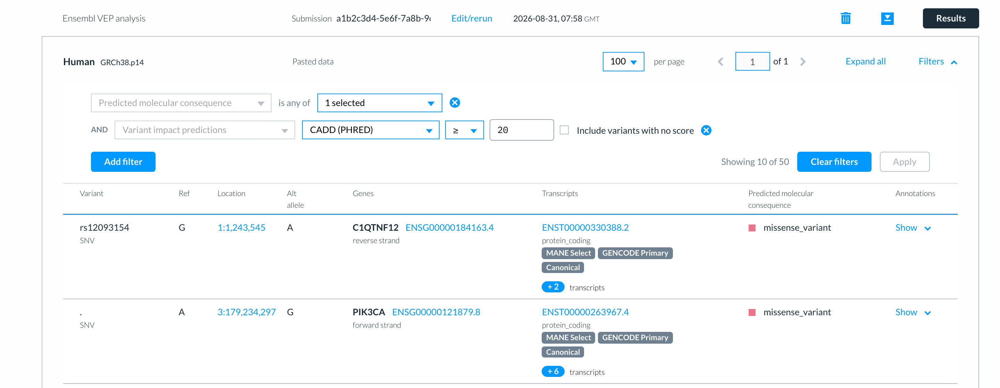

# Filtering Ensembl VEP results

You may wish to filter your variants depending on the hypothesis being tested. For example, you may be interested in only certain consequences, or variants that are in a certain gene. Similarly, you may only be concerned with rare variants that also have predicted variant impact scores above a certain threshold.

Select __Filters__ above the results table to open the filter panel.

<figure>
  
  <figcaption>
    The filter panel, before any filters have been added.
  </figcaption>
</figure>

## Adding a filter

Select __Add filter__. A row appears with a menu of the things you can filter on:

* __Predicted molecular consequence__ — one or more consequence terms
* __Transcript__ — one or more Ensembl transcript IDs
* __Gene name__ — one or more gene symbols
* __Ensembl gene ID__ — one or more Ensembl gene IDs
* __Transcript group__ — e.g. MANE Select, MANE Plus Clinical, GENCODE Primary or canonical transcripts 
* __Allele frequency__ — a threshold against the allele frequencies your job reported
* __Variant impact predictions__ — a threshold against one of the scores your job reported

Choose a field, then give it a value.

<figure>
  
  <figcaption>
    Choosing consequence terms. They are grouped as they are in the results table.
  </figcaption>
</figure>

Select __Apply__ to filter the table. The count beside the button tells you how many results are left, for example 'Showing 19 of 50'.

<figure>
  
  <figcaption>
    Results filtered to missense variants.
  </figcaption>
</figure>

## Filtering on more than one thing

Select __Add filter__ again for a second condition. Conditions are combined with AND: a result is kept only if it satisfies every one of them.

<figure>
  
  <figcaption>
    Two conditions: missense variants with a CADD (PHRED) score of 20 or more.
  </figcaption>
</figure>

Some fields can only be used once - you choose all your consequence terms in a single condition, rather than adding one condition per term. Others, such as gene name, can be used more than once.

To remove a condition, select the cross at the end of its row. __Clear filters__ removes them all.

<figure>
  
  <figcaption>
    Results filtered by both conditions.
  </figcaption>
</figure>

## Filtering on allele frequency

An allele frequency filter asks for a threshold between 0 and 1, and whether to test:

* __any__ allele frequency source your job reported
* __all__ of them
* __specific selections__ you choose.

A variant with no allele frequency in the sources being tested is retained.

## Filtering on impact scores

Each score is its own filter option, because they have independent scales. For example, CADD (PHRED) runs from around 0 to 99, many missense predictors report a probability between 0 and 1, popEVE is a negative log-scale score, and SpliceAI reports four separate delta scores for four different events.

Choose the score, then whether you want values at or above (≥) or at or below (≤) your threshold.

Variants with no score for a selected variant impact prediction are removed by default. Tick __Include variants with no score__ to retain them. 

## What you can filter on

You can only filter on data your job produced. If you did not ask for CADD when you set the job up, there is no CADD data, so no filter; if you asked for no allele frequencies, there is no allele frequency filter. To filter on something you did not choose, use __Edit/rerun__ in the jobs list to run the job again with that option turned on.

## Downloading filtered results

While filters are applied, the VCF and TSV downloads contain the filtered results only. Clear the filters first to download everything.
