# How to use the Ensembl Variant Effect Predictor (Ensembl VEP)

The Ensembl VEP app can be found on the toolbar at the top of the Ensembl platform.

<figure>
  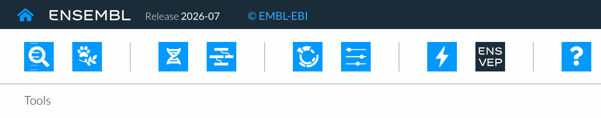
  <figcaption>
    A view of the toolbar showing the Ensembl Variant Effect Predictor (Ensembl VEP) icon.
  </figcaption>
</figure>

To run an analysis job you need to:

* select a genome relevant to the assembly your variants were called against
* add your variants
* run your analysis job

For variants called against GRCh38, you can also choose other analysis options before you run the job.

<figure>
  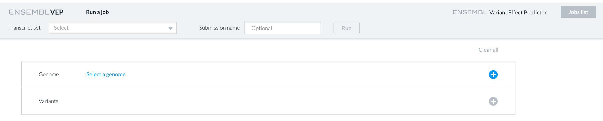
  <figcaption>
    A view of the Ensembl VEP input interface.
  </figcaption>
</figure>

## How to select a genome for Ensembl VEP

First select the genome you would like to run your variants against. We recommend you use the latest integrated release for the assembly your variants were called against so you benefit from the latest functional annotation. You can either click a previously selected species from the bar at the top of the screen, or Choose __Select a genome__ to reveal a search box.
You can search for a genome using the:

* common name
* scientific name
* taxon id
* assembly id

<figure>
  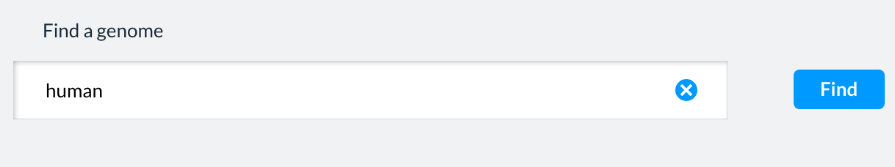
  <figcaption>
    The genome search box.
  </figcaption>
</figure>

A table of the matching genomes will be displayed. Alongside each assembly the table gives its release, whether it is the reference assembly for that species, its accession, and a link to the files on our FTP site.

<figure>
  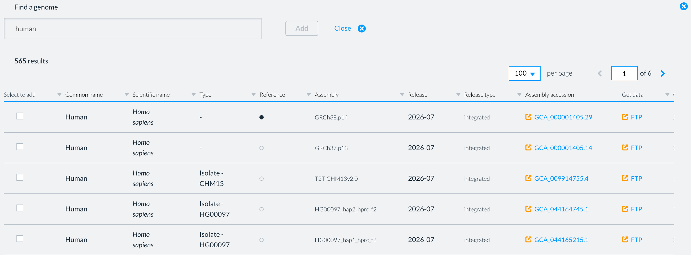
  <figcaption>
    A table of the genome assemblies produced from a search for human.
  </figcaption>
</figure>

Choose the matching genome of interest by selecting the box to the left of the assembly, followed by the green __Add__ button.

The chosen genome will be displayed in the Genome section of the Ensembl VEP input page. To choose a different one, select __Change__.

### Transcript set

Once you have chosen a genome, the transcript set your variants will be annotated against is displayed at the top of the page.

## How to add your variant data

All variant data must be in Variant Call Format (VCF). Additional formats will be supported in future versions of Ensembl VEP.

A header line is optional. Each variant needs at least the chromosome, position, reference allele and alternative allele.

There are two ways to add your variants:

* __Paste__: copy and paste your variants (in VCF) into the large text box displaying 'Paste data'.
* __File upload__: drag and drop your VCF file onto the box marked 'Click or drag a VCF here', or click inside the box and locate the file on your system. Files may be up to 250 MB.

<figure>
  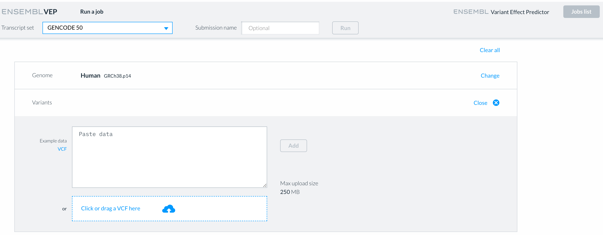
  <figcaption>
    Adding variants to the Ensembl VEP input form, by pasting or by uploading a file.
  </figcaption>
</figure>

If you would like to try the tool without data of your own, select __VCF__ under Example data to fill the box with an example variant (where available).

Select the green __Add__ button, and your variants will be displayed in the Variants section. To change them, select __Change__ to the right of the section.

## Choosing which analysis options are run

Once your variants have been added, the __Job options__ appear below them. These are grouped into panels, and enable additional annotation of your variants — availability of these options varies by genome.

<figure>
  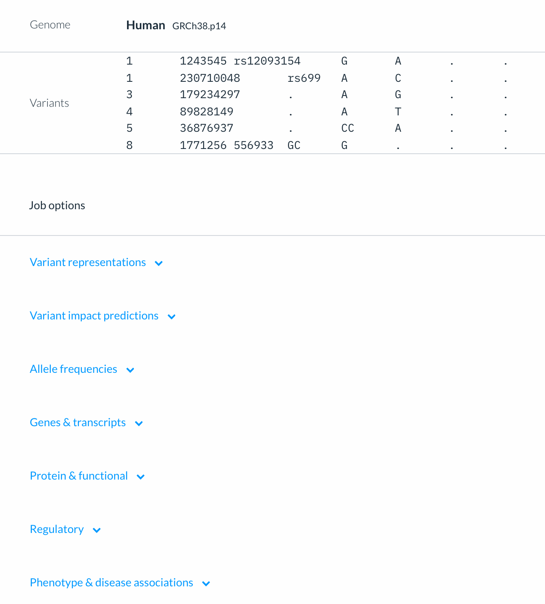
  <figcaption>
    The Job options section of the Ensembl VEP input form.
  </figcaption>
</figure>

Nothing is enabled by default, your results will always name the genes and transcripts your variants fall in and the predicted molecular consequence for each; everything else is yours to choose.

For a full description of the options, see Choosing what Ensembl VEP annotates.

## Naming your job

You can add a name for your job by typing it into the box alongside the __Submission name__. This makes it easier to identify your jobs later. The name is optional.

<figure>
  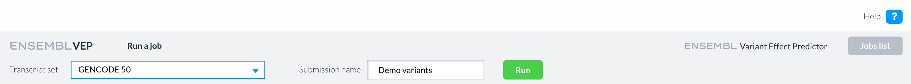
  <figcaption>
    The transcript set, submission name and Run button at the top of the Ensembl VEP input form.
  </figcaption>
</figure>

## Running your Ensembl VEP job

To run your job select the green __Run__ button, and you will be taken to the jobs list.

The jobs list shows the jobs you have submitted, most recent first. Each shows its genome, whether the variants were pasted or uploaded, the submission name if you gave one, and the date and time of submission. While a job is waiting it is marked 'Queued', and while it is being processed, 'Running...'.

<figure>
  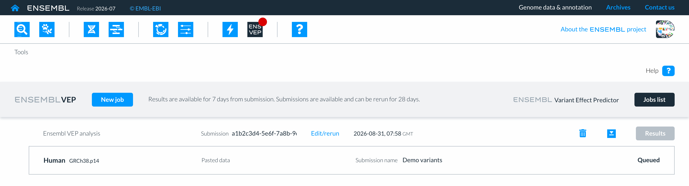
  <figcaption>
    The Ensembl VEP jobs list showing a job that has been submitted.
  </figcaption>
</figure>

If you navigate away from Ensembl VEP while a job is running, a green dot appears on the Ensembl VEP icon in the toolbar when it has finished.

<figure>
  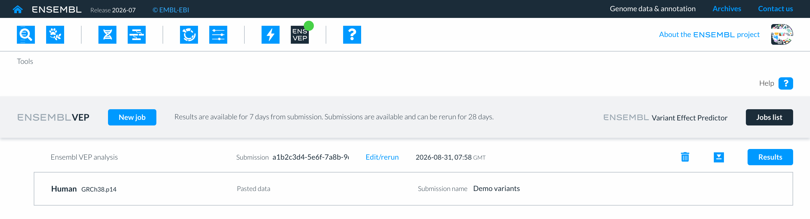
  <figcaption>
    A completed job in the Ensembl VEP jobs list.
  </figcaption>
</figure>

From the jobs list you can also:

* __Edit/rerun__ a job, which returns you to the input form with the same genome, variants and options, ready to be changed and run again
* __delete__ a job, using the bin icon
* __download__ the results, using the download icon.

Results are available for 7 days from submission. Submissions are available and can be rerun for 28 days.

To run another job, select the blue __New job__ button.

## How to view your Ensembl VEP results

To view your results, select the __Results__ button to the right of the job once it has completed.

<figure>
  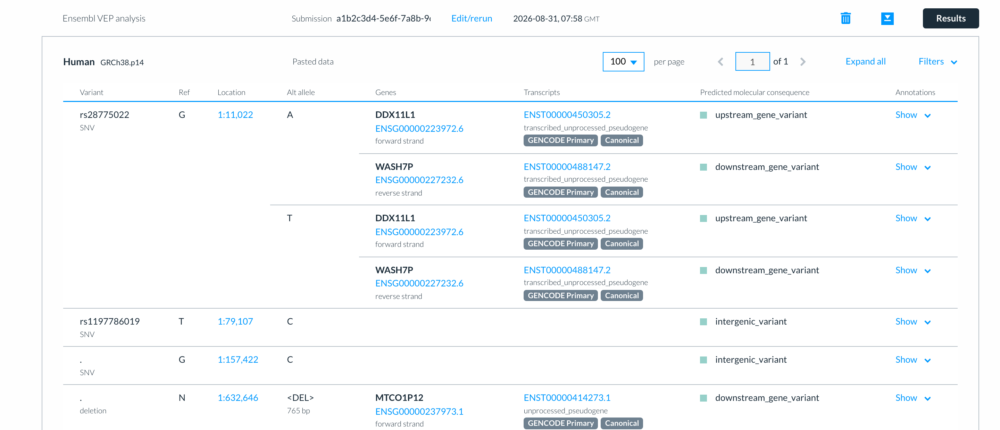
  <figcaption>
    A table of Ensembl VEP results.
  </figcaption>
</figure>

The table shows, for each of your variants:

* __Variant:__ its name, if it has one, and its type (e.g. SNV, deletion)
* __Ref:__ the reference allele
* __Location:__ the sequence/chromosome name and position
* __Alt allele:__ each alternative allele in turn, described by type and length for structural variants
* __Genes:__ the gene symbol, Ensembl gene ID and strand of every gene the variant falls in
* __Transcripts:__ the Ensembl transcript ID and biotype of every transcript the variant falls in, labelled where the transcript is MANE Select (human GRCh38), GENCODE Primary (human GRCh38) or canonical ( all species/assemblies)
* __Predicted molecular consequence:__ for each transcript, coloured by the consequence grouping
* __Annotations:__ any further annotations you selected from in job options

Where a variant falls in many transcripts, the first is shown and the rest are collapsed behind a count, for example __+ 25__ transcripts. Select the count to see them all.

Use the __per page__ menu to show 10, 50 or 100 variants at a time, and the arrows to move between pages.

### Viewing a relevant locations, genes and transcripts elsewhere in Ensembl

Locations, gene IDs and transcript IDs in the table can be selected to open that feature in another Ensembl app, like the Genome browser and Feature explorer, depending on what is available.

<figure>
  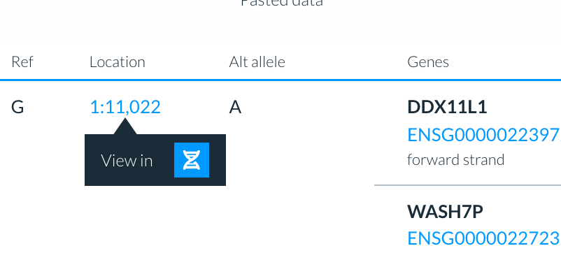
  <figcaption>
    Opening a variant location in another Ensembl app.
  </figcaption>
</figure>

### Viewing your annotations

If you chose any additional options, each row has a __Show__ link in the Annotations column. Select it to open a panel  showing all results, grouped under the same headings as the job options.

<figure>
  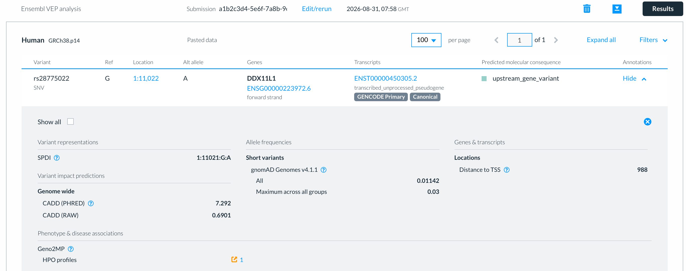
  <figcaption>
    The annotations for one variant and transcript.
  </figcaption>
</figure>

By default the panel does not show headers for empty results. Tick __Show all__ to see everything you asked for, with a dash where there was no result.

To open every panel on the page at once, select __Expand all__ above the table. This option only expands the first transcript when multiple are available.

## Filtering your results

Select __Filters__ above the table to narrow your results - by consequence, gene, transcript, allele frequency or impact score. For more help with this feature, see Filtering Ensembl VEP results.

## Downloading your Ensembl VEP results

Select the download icon to the left of the Results button, then choose __VCF__ or __TSV__.

<figure>
  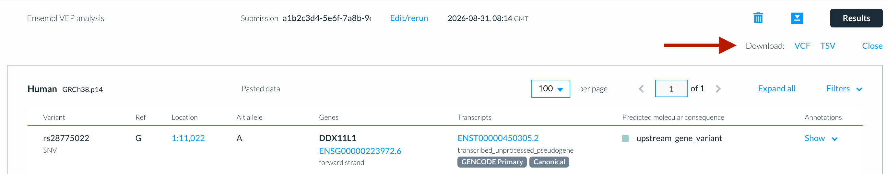
  <figcaption>
    Downloading Ensembl VEP results as VCF or TSV.
  </figcaption>
</figure>

If you have filters applied, the download contains the filtered results only. Clearing any active filters will enable you to download the entire result set again.
