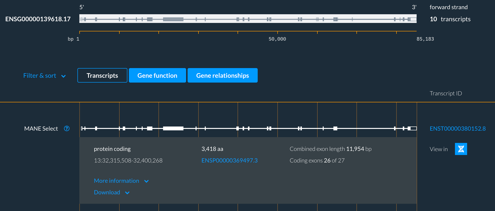

# What is the Entity viewer?

Entity viewer reveals detailed information about an entity ie a gene of interest and their related transcripts, proteins and functions.

The Entity viewer consists of a Navigation bar, the Main display, the Right-hand panel and an Action bar.

First image 

## Navigation bar

The Navigation bar summarises details of an entity such as a gene. For a gene the summary lists the gene symbol, Ensembl stable ID, biotype, strand and genomic coordinates. 

## Main display

The Main display presents detailed data relating to the entity ie a gene, its transcripts and proteins. 

Visual summary

The visual summary for a gene shows a Ensembl gene stable ID, the genes length, strand and transcript count. Exon are represented with grey boxes and introns with grey lines.

Please note that the gene is always displayed in the direction of transcription (5'->3') regardless of the strand of the genome on which it is located.

You can also go to the Genome browser from here to view your gene of interest plotted against the genome, by clicking the ‘View in Genome browser’ icon.

Transcript and Gene function panels

Detailed data about an entity is found in the panels below the visual summary, for genes the Transcript panel shows all transcripts for the gene. 

The Gene function panel presents protein information for all coding transcripts for the gene of interest.  

An ‘active’ tab appears black.

## Right-hand panel
 
The Right-hand panel provides additional information about the entity of interest. For a gene this information is found in the Overview and External reference tabs in the Right-hand panel.
 

## Action bar

The Action bar displays a variety of actions you can take. Each action is represented by a specific icon.

Open the Right-hand panel

Select the right pointing arrow to open and close the Right-hand panel.

Find a gene

Select the magnifying glass icon to search for an entity ie a gene. 

Previously viewed

Select the bookmark icon to see previously viewed entities ie genes or transcripts.

Previously viewed is an auto-generated browsing history of up to 20 genes (or other entities) previously loaded within the Entity viewer application.
 

Download

Select the underlined down arrow icon to download sequence data.

Download enables export of the sequence data for an entity. If your entity is a gene you can download the genomic sequence and all of its transcripts and translations.

To download tick the box next to the sequence data you need then select the green Download button. Sequence data are exported in FASTA format.
