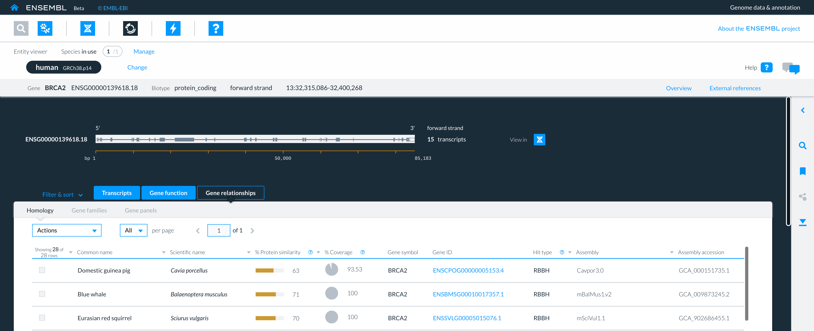

# How to find homologous genes in the Entity viewer

The Gene relationships panel in the detailed view of a gene contains a homology table.

The table lists genes homologous to the user's gene of interest found in a reference collection of species genomes. 

Homologous genes share a common ancestor, being separated 'split' by a speciation event or a gene duplication event.

The homology table for a gene is the first tab in the gene relationship panel found in the detailed view of a gene in the Entity viewer.

<figure>
  
  <figcaption>
    A view of the homology table for BRCA2 in the Gene relationship panel of the Entity viewer.
  </figcaption>
</figure>

For each homologous gene found in a species genome from the reference collection the following information is provided:

* __Common name__: Domestic guinea pig
* __Scientific name__: _Cavia porcellus_
* __% Protein similarity__: The percentage of identical amino acid residues aligned against each other.
* __% Coverage__: The percent of query which is in local alignment with the respective reference.
* __Gene symbol__: Gene symbol for homologues in each species - these may vary between species .
* __Gene ID__: the Ensembl ID - ENSG eg ENSCPOG00000005153.4.
* __Hit type__: The type of homology: RBBH: reciprocal best blast hit, BBH: best blast hit.
* __Assembly__: Genome assembly.

### Customising the table

You can reorder the table by sorting on a specific column. To sort the content of a column click on the arrow next to the column heading.

Sorting a specific column will in turn reorganise the information in all other columns of the table.

You can also customise the table by hiding unwanted rows and columns by selecting the appropriate option in the Actions dropdown at the top left of the homology table.

You can download both a customised or uncustomised version of the table selecting the download option in the Actions dropdown.