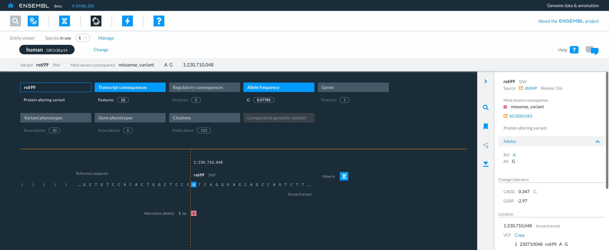
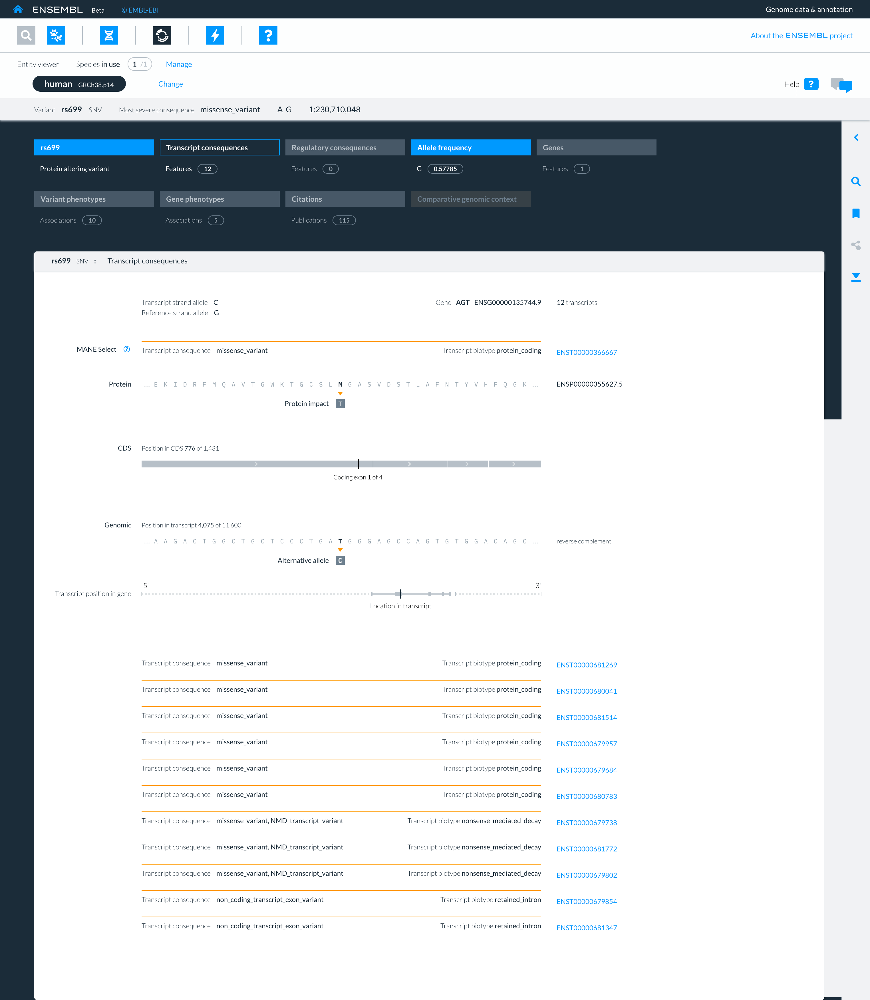
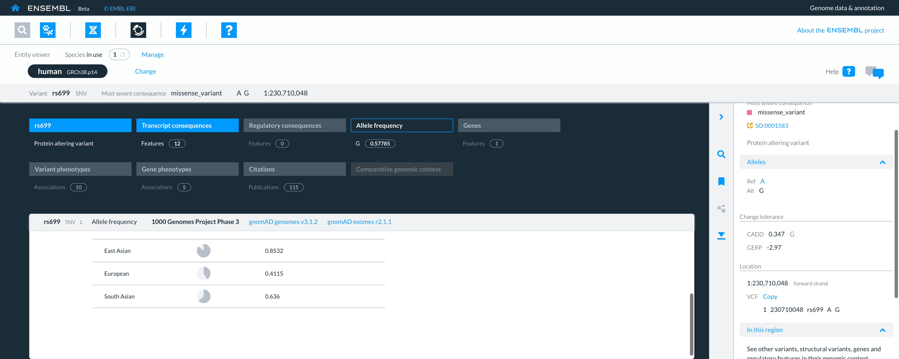

# How to view variants in the Entity viewer?

The Entity viewer reveals detailed information about a variant, such as its predicted molecular consequences, population allele frequencies and phenotype associations.

The view of variants in the Entity viewer consists of a navigation bar, the main display, the right-hand panel and an action bar.

<figure>
  
  <figcaption>
    A view of the variant rs699 in the Entity viewer.
  </figcaption>
</figure>

## How do I find key information about a variant? 

Key information about a variant is summarised on the navigation bar and in the right-hand panel.

### Variant summary on the navigation bar 

The key information listed on the navigation bar, for each variant, is the  
* id eg rs1663519126
* type eg insertion
* most severe predicted consequence eg missense_variant
* reference allele eg G
* alternative allele eg GC
* genomic coordinates on the specific genome assembly eg 1:230,709,875.

### Variant information on the right-hand panel 

The information listed on the right-hand panel for each variant, includes all the information displayed in the navigation bar (see above),
along with additional information about the variant’s:

* source and version eg dbSNP release 156
* link to the Sequence ontology (SO) terms for the most severe predicted molecular consequence
* all variant alleles 
* change tolerance scores (CADD and GERP) 
* location and strand (forward or reverse) on which the variant is reported
* representation in Variant Call Format (VCF).

## How do I find detailed information about a variant? 

Detailed information about a variant is presented within the nine panels found in the main body of the Entity viewer.

Currently only three panels contain data 

* Variant summary panel (default panel)
* Transcript consequences
* Allele frequency.

### What's in the variant summary panel (default)?

The variant summary panel (default) displays a zoomed in view of the reference sequence showing the location of the reference allele on the forward strand and the alternative allele(s) directly below. 

#### Variant types

The variant allele(s) are shown directly below the reference allele for all variant types.

Different types of variants have specific visual representations in the entity viewer.

All altered, deleted, substituted, indels and inserted bases are coloured to represent the specific group of short variants to which they belong (see short variant groups in the right-hand panel of the Genome browser.)

* SNV: the altered base is shown directly below the reference allele.
* Deletions: deleted base(s) are shown directly the below the bases that are deleted from the reference sequence, which are highlighted in blue.
* Insertions: inserted base(s) are shown directly the below the inserted base(s) in the reference sequence and coloured to represent the specific group of short variants to which the allele belongs.
* Indels: inserted, deleted, or inserted and deleted nucleotides base(s) are shown directly the below the inserted, deleted, or inserted and deleted nucleotides in the reference sequence and coloured to represent the specific group of short variants to which the allele belongs.
* Substitutions: substituted bases are shown directly the below the below the bases that they substitute in the reference sequence. The reference sequence bases that are substituted are highlighted in blue.

### What's in the transcript consequences panel?

The transcript consequence panel shows all the Ensembl transcripts that overlap a variant and the effects that each allele of the variant may have on their transcripts ie the transcript consequences.

<figure>
  
  <figcaption>
    A view of the transcript-consequences panel in the Entity viewer.
  </figcaption>
</figure>

The main view of transcript consequence panel shows the: 
* variant ID eg rs699
* variant type eg SNV
* transcript strand allele eg C  (this will differ from the allele on the genomic forward strand for genes on the reverse strand)
* genomic reference strand allele eg G
* name and identifier of gene the transcript belongs to containing the variant eg BRCA2, ENSG00000139618
* number of transcripts eg 12 

This information is followed by a list of the Ensembl transcripts overlapping the variant, displaying each transcript’s:
* transcription consequence eg missense_variant
* transcript biotype eg protein-coding
* transcript ID eg ENST00000366667

#### Detailed transcript information

Further details of the first transcript on the list (generally the MANE or canonical transcript) are shown by default.

Details are shown in visualisations of the transcript show details of 

* the affected amino acids in the protein sequence produced from the transcript
* the position of the mutation in the CDS produced from the transcript
* the position of the alternative allele in the genomic sequence of the transcript
* the location of the transcript and mutation within the gene.

By selecting the transcript id ie ENST the same details can be revealed for each transcript.

### What’s in the allele frequency panel?

The allele frequency panel provides allele frequency data from the 1000 Genomes Project (phase 3) and the genome Aggregation Database (gnomAD) for genomes (gnomAD genomes v3.1.2) and exomes (gnomAD exomes r2.1.1).

The allele frequencies for global and sub-populations are displayed both numerically and visually.

The visual representation is a pie chart in which the altered allele frequency in each population is shown in dark grey and the reference allele frequency in a light grey. 

<figure>
  
  <figcaption>
    A view of the allele frequency panel in the Entity viewer.
  </figcaption>
</figure>