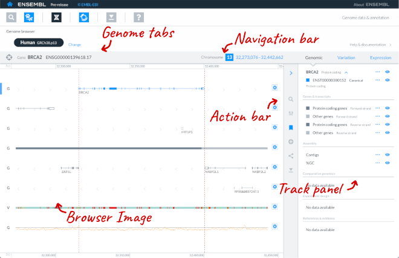

# What is the Genome browser?

The Genome browser displays a genomic region of interest. There are five parts to the Genome browser:
* Browser image
* Navigation bar
* Track panel
* Genome tabs
* Action bar

## Browser image

The main part of the page is the browser image, showing your gene, variant or location of interest within the genome. The genomic features within that location, are represented on horizontal tracks across the genome. 

### Focus entity

If you have gone to the Genome browser by searching for a gene or other entity, this will be highlighted as your Focus entity.

## Navigation bar

You can see the genome coordinates of your region of interest in the Navigation bar. If you have a Focus entity, details of this will be displayed too. 

## Track panel

The track panel lists all available tracks that can be viewed in the browser. 

### Tracks

Tracks show sets of data such as transcripts, genes (coding and non-coding), genetic variants or regulatory regions plotted horizontally along the genome. 

You can use controls in the Track panel to show or hide tracks and to learn more about the track data.

Track and feature labels can be turned on and off using controls found in the cog icons on the right hand side of tracks in the browser.

## Genome tabs

The Genome tabs display the genomes you have chosen to look at using the Species selector app, which may include multiple genomes of the same species. The genome you are currently using is shown in black. You can click on other genomes to see regions of interest in these genomes. When you navigate to another genome, the region and track configuration set on this genome will be held in state until you return to it.

## Action bar

The Action bar gives you options to search for an entity, manage tracks, see previously viewed entities, add your own data, share the view and download data.

Greyed out icons are not currently active.
