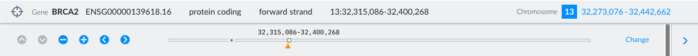

# Genome browser navigation

You can navigate the Genome browser using a combination of the Navigation bar and mouse or track pad actions.

## How to adjust position using the Navigation bar

The blue coordinates on the right of the Navigation bar, next to the chromosome number, indicate your current genomic position in bp.

You can expand the Navigation bar by selecting on the blue coordinates to reveal a set of navigation controls. 

Select Change on the right to enter new genomic coordinates.

Use the plus and minus icons to zoom in and out and the arrows to move left and right.

Hide the navigation by selecting the blue coordinates to the right of the Chromosome number again.

## How to adjust position using a mouse or track pad

To navigate using a mouse, move the cursor into the browser. To move left or right by click and drag the mouse in either direction. 

You can zoom in or out using the scroll wheel or two-finger scrolling on a trackpad – you will zoom towards the position of your cursor.

## Return to the original position Focus entity

To return to the region of your Focus entity, select the target icon on the far left of the Navigation bar, which will be blue when you are away from the Focus entity. When you are looking at the Focus entity, the target icon icon will be grey.

The coordinates of the Focus entity (ie gene, transcript or variant) are shown on the left of the Navigation bar. As you move around using either the Navigation bar, mouse actions or track pad the Focus entity target coordinates remain constant.
