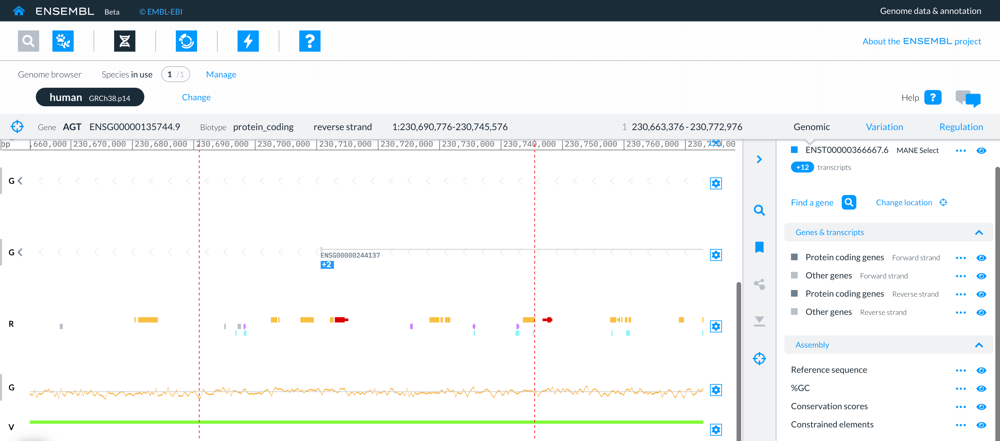
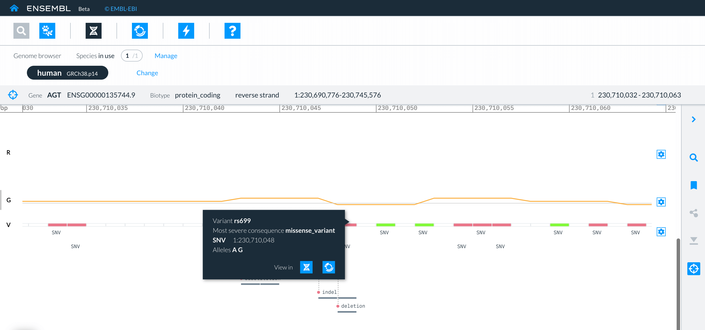

# How to view variants in the Genome browser?

## How do I find the variants within a gene?

Search for your gene of interest, using Find a gene. 

Select your gene of interest and pick the DNA symbol to view the gene in the genome browser.

Your gene of interest is the focus of the view in the Genome browser. 

The gene boundaries are highlighted in the browser by red dotted lines.

The variant track is displayed toward the bottom of the view as a green line. 

<figure>
  
  <figcaption>
    A focus gene view of the genome browser showing the variant track in green. The track is marked with a V on the right-hand side.
  </figcaption>
</figure>

Currently the variant track only displays short variants. 

Use your mouse or keypad to zoom into the variant track to reveal individual variants in the region, their variant types and their variant consequences.

### Variant types:

Different types of variants have specific visual representations in the variant track

* SNV: altered bases are coloured to represent the specific group of short variants to which they belong (see short variant groups in the right-hand panel).
* Deletions: deleted bases are represented by grey boxes alongside a circle labelled deletion. The colour of the circle represents the group of short variants the deletion belongs to. The dotted line leads back to the location of the deletion in the genome.
* Insertions: are represented by a circle labelled insertion at the end of a dotted line that leads back to the location of the insertion in the genome. The colour of the circle represents the group of short variants the insertion belongs to.
* Indels: the deleted bases in an indel are represented by grey boxes alongside a circle labelled indel. The colour of the circle represents the group of short variants the indel belongs to. The dotted line leads back to the location of the indel in the genome.
* Substitutions: substituted bases are represented by grey boxes alongside a circle labelled substitution. The colour of the circle represents the group of short variants to which the substitutions belong. The dotted line leads back to the location of the substitutions in the genome.

### Short variant groups:

The types of variant consequence have been organised into five groups based on the effect the short variants have on the proteins, splicing, transcripts, regulatory and intergenic regions, as shown in the right-hand panel under short variant groups.

The individual variant consequences found in each group are listed in the right-hand drawer which   can be accessed by selecting the three dots to the right of each group.

eg A list of individual variant consequences in the Protein altering variant group

The variants in each short variant group are represented by different colours:

* Protein altering variants are red
* Splicing variants are orange
* Transcript variants are green
* Regulatory region variants are teal
* Intergenic variants are light blue

## How do I focus on a specific variant? 

If you see a variant you would like to focus on select the variant on the track.

<figure>
  
  <figcaption>
    A zoomed in view of the variant track. Showing a selected variants pop up menu.
  </figcaption>
</figure>

A menu will pop up that lists the variant’s:

* name 
* most severe consequences
* type
* location
* alleles

and the option to see view the variant in the genome browser or entity viewer.

If you select the genome browser the variant track will move to the top of the genome browser and the variant of interest will become the central focus of the view.

### How do I find key information about a variant? 

Key information about the variant is summarised on the navigation bar and in the right-hand panel.

### Variant summary on the navigation bar and in the right-hand panel

The key information on the navigation bar and right-hand panel lists the variant’s:
* id eg rs1663519126
* type eg insertion
* most severe consequences of the variant eg non_coding_transcript_exon_variant
* reference allele eg G
* variant allele(s) eg GC
* genomic coordinates eg 1:230,709,875.

