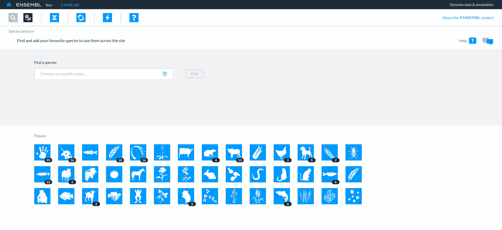
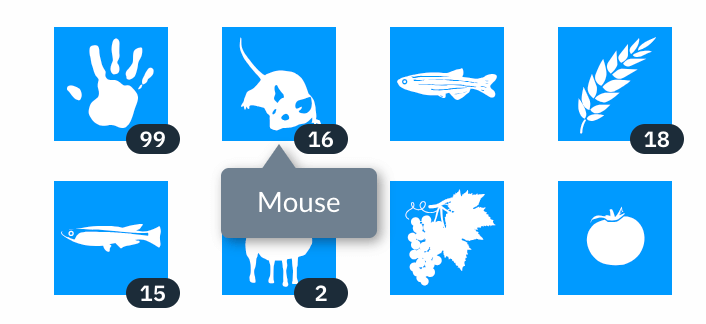
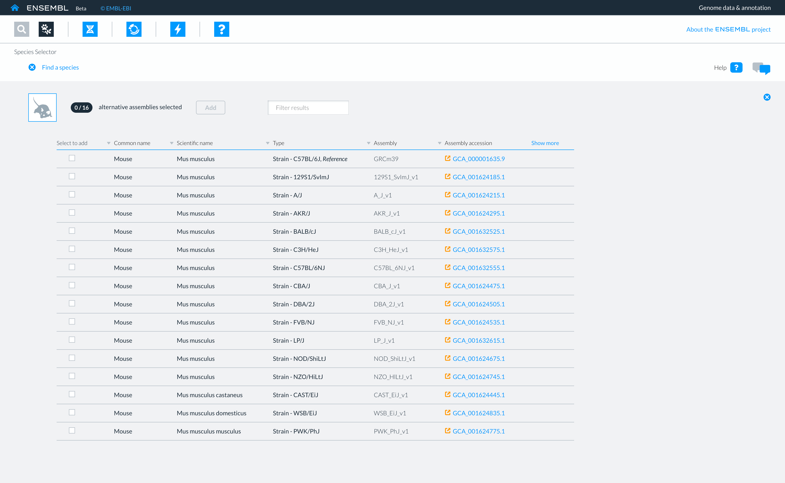
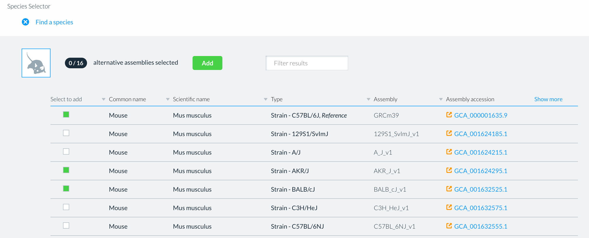
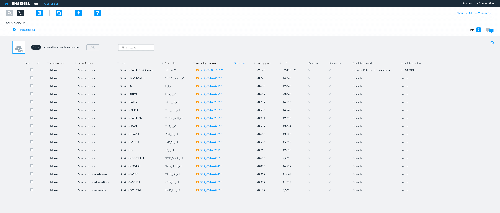
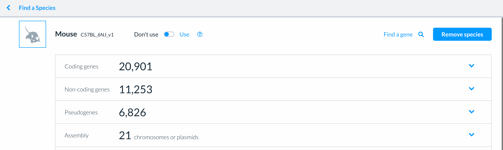
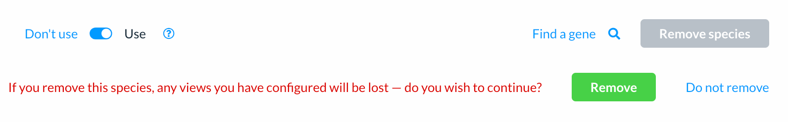
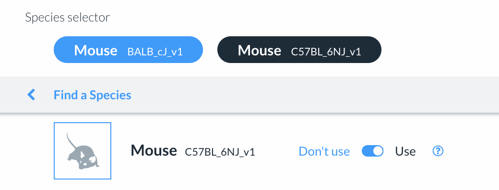
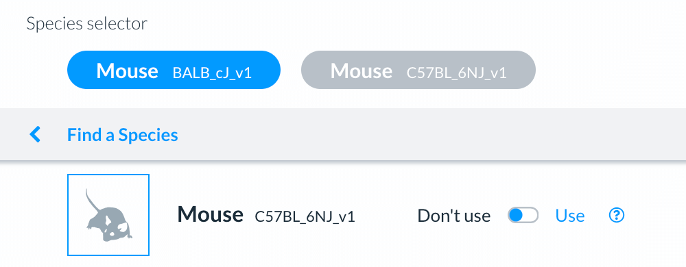

# How do I add or remove a species?

You can use the Species selector to:

- choose a species genome, to work with in other apps 
- create a list of genomes, to work with in other apps 
- remove a genome from your list and 
- explore the composition of a genome ie the number of coding and non coding genes, variants, regulatory features and pseudogenes.

<figure>
  
  <figcaption>
    The Species selector landing page showing a search box and icons of the 42 most popular species.
  </figcaption>
</figure>

## How to choose a genome for a species

You must select a species genome to start using any Ensembl app. 

You can then investigate the genes, variants and orthologues of that species genome in another app ie the Genome browser or Entity viewer.

There are two ways to select a species genome in the Species selector:

### Choosing a genome from the 42 most popular species.

<figure>
  
  <figcaption>
    Eight icons of the 42 most popular species showing the number of genome assemblies available for each species.
  </figcaption>
</figure>

Select the icon representing your species of interest from the 42 most popular species.

You will see a table of the genome assemblies for that species. 

Pick the genome assemblies of interest to you by selecting the box to the left of each genome assembly followed by
the Add button.

The selected genome name and assembly appear in a lozenge at the top of the view in each app.

### Searching for a species genome

You can search for a species genome, using the: 
- common name 
- scientific name
- type, strain or cultivar
- assembly name and
- assembly accession number.

Depending on your search term you will see:

- a single species genome or
- a table of genome assemblies for a species.

Pick the genome assembly you are interested in using the box to the left of an assembly and select the green Add button.

The details of the chosen species genome will appear in a lozenge at the top of each app.

## How to create a list of genomes

You can create a list of genomes by adding one or more genome assemblies from the table.

Your list of species genomes can be used in all other apps, ie the Genome browser or Entity viewer.

The lozenges representing the species genomes are displayed in a row at the top of each app.

### How to find specific genomes in a large table of assemblies

The genome assembly table for each species displays information chosen to help you decide which genome you would like to work with. ie Assembly name, Assembly accession number, type, strain and cultivar.

Select Show more (top right) to see the whole table.

#### How to filter the table contents

You can also filter a table of genome assemblies by entering the:

- common name 
- scientific name
- type, strain or cultivar
- assembly name
- assembly accession number
- annotation provider or
- annotation method

into the filter box above the table of genome assemblies.

#### Removing a species genome

You can remove a genome by selecting the 'Remove species' button, on the top right of the Species homepage. 

The Species homepage

You can navigate to a Species homepage by clicking on the species genome lozenge. 

The Species homepage also contains more information about the genes, variants of species genome, details about the genome assembly and the controls to manage a list of species genomes.

### How to remove a genome

Select the 'Remove species' button, on the top right of the Species homepage. 

A warning message will be displayed. Select the green 'Remove' button to delete the species genome fron your list.

## Deactivating a species genome in your list 

You can deactivate a species genome by toogling to 'Don't use' at the top of the Species homepage.

The deactivated species genome lozenge will remain in your list and turn grey. Active species genome lozenges remain blue.

