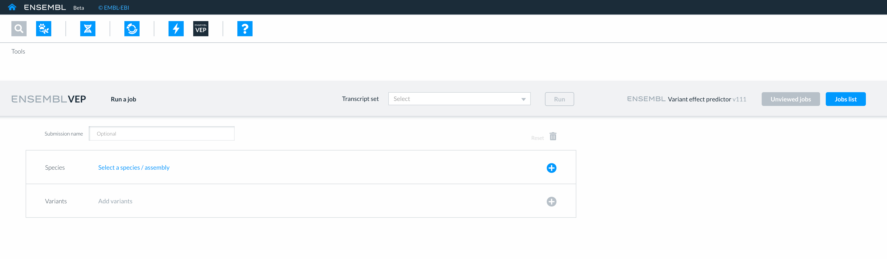
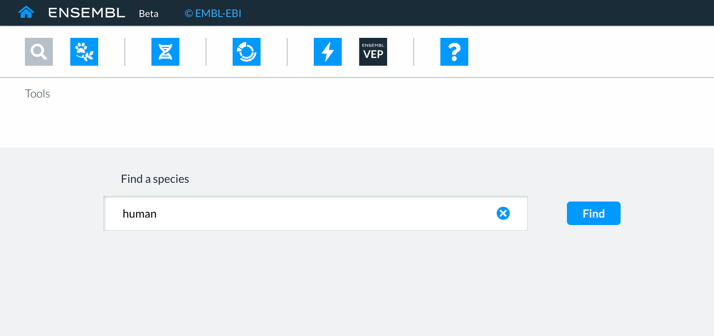

# How to run the Ensembl Variant Effect Predictor (VEP)

The Ensembl Variant Effect Predictor (VEP) tool can be found on the toolbar at the top of the Beta site.

<figure>
  
  <figcaption>
    A view of the tool bar showing the Ensembl Variant Effect Predictor (VEP) icon.
  </figcaption>
</figure>

To use the  VEP tool, you need to 
* select a species genome assembly
* enter your data
* run your job.

<figure>
  
  <figcaption>
    A view of the VEP input interface.
  </figcaption>
</figure>

## How to select a species genome for VEP
First select the species genome which you would like to run your variants against. 
Choose Select a species /assembly to reveal a search box.
Searching for a species genome
You can search for a species genome or assembly, using the:
* common name
* scientific name
* assembly name and
* assembly accession number.

<figure>
  
  <figcaption>
    A search for human genomes using the common name.
  </figcaption>
</figure>

A  table of the genome assemblies for that species will be displayed

Choose the genome assembly of interest  by selecting the box to the left of the assembly followed by the green Add button.
The chosen species genome assembly will be displayed in the Species section of the VEP input page.

## How to upload your variant data
All variant information must be in Variant Call Format(VCF) to be uploaded into VEP.
There are two ways to upload your variant data:

Paste: simply copy and paste your variant information (in VCF) into the large text box displaying ‘Paste data’. 

Then select the Add button and your input data will be displayed in the Variants section

File upload: to upload your file of variants (in VCF) you can either:  
* drag and drop the file directly onto the cloud icon inside the box  
or
* click inside the box and locate the file on your system. 

Then select the blue Open button and your input data will be displayed in the Variants section.
The variants you are running against the chosen genome assembly  will be displayed in the variant section on the VEP input page.
To update or edit your choice of variants select Change to the right-hand side of the Variant section. 

## Additional information associated with test variants 
VEP can provide information associated with the variants identified in a specific genome assembly. 

VEP can provide additional information about 
* __Gene and transcripts__ in which variants are located
* __Predictions__ of the effect of variants on transcripts, protein structure and function and pathogenicity 
* __Variant population frequencies__
* __Variant phenotypes__
* __Citations__ for variants
* __Regulatory annotation__ 
* __Conservation and constraints__ of the location of variants

### Options in the current  versions of VEPs
In the current version of VEP the Gene symbol and Transcript biotype associated with a variant are  selected by default and will be displayed in the results.

### Options in future versions of VEPs
In future versions of VEP you will be able to select additional types of information (listed above) associated with your variants of interest.   

### Naming your job(s)
You can add a name for the data you upload by typing it into  the box alongside the Submission name. 
This can make it easier for you to identify jobs and files that you have uploaded to the VEP at a later point.

## Running your VEP job
To run your job select the green Run button on the top  grey bar to the right-hand side of the Transcript set and you will be taken to the submission page. 
The submissions page will show the jobs that are currently ‘running’ or recently completed. 
A submission ID is assigned to each submission and additional information is provided, including the date and time of submission. 

If you navigate away from the VEP interface, while the job is still running  the status of the query is indicated by the VEP icon in the top panel changing from red to green to prompt you that it has successfully completed.
Jobs are divided into two lists: ‘Unviewed Jobs’ and ‘Jobs list’.
A submission in the ‘Unviewed jobs’ list, when viewed, is transferred to the ‘Jobs list’ for future reference. Results are available for 7 days and queries can be rerun for 28 days.
Select the blue New job button in the top grey bar (to the left-hand side of ENSEMBL VEP logo) to run another job.

## How to view your VEP results 

To view the results of your VEP job  select the Results button to the right-hand side of the job on the submissions page, once the job has completed and the Results button has turned blue.

You will be taken to the  results page which will display the table of results for the variant(s) submitted against the genome assembly chosen.

The table currently shows the following information about the variant(s) found on the chosen genome assembly.
* __Variant type__ eg SNP
* __Reference allele__ for the variant eg A
* __Alternative allele__ for the variant eg G
* __Location__ of the variant eg 1:230,710,048
* __Gene(s)__ (symbol, ENGS and strand) that contain the variant eg AGT,  ENSG00000135744 ,reverse strand
* __Transcripts__, (ENSTs and  biotype) that contain the variant eg ENST00000366667.1, protein_coding
* __Predicted molecular consequence__ for each transcript containing the variant eg coding-sequence -variant

### Downloading VEP results
You can download the results table by clicking on the blue Download icon to the left hand side of the black Results button.

