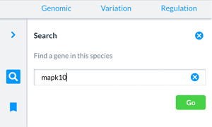
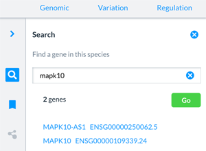
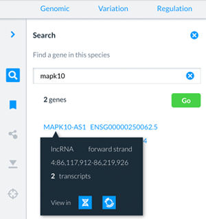

# In-app search

You can search for a gene of interest within the Entity viewer and Genome browser apps.

To search, either select the magnifying glass icon in the Action bar or select 'Find a gene' in the Right-hand panel of each app.

Here you can do a simple search for a gene symbol (eg MAPK10) or ID (ENSG00000109339.24). The results will list the gene symbols and ID of a gene. 

Select your gene of interest from the search results.

A pop-up menu giving details of the gene will pop up with links to the Genome browser and Entity viewer.

To view the gene with in the genome select the Genome browser icon. For details of the gene, its transcripts and proteins select the Entity viewer icon.

