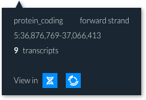

# In-app search

Within the Entity viewer and Genome browser, you can search for genes of interest. To search, click on the magnifying glass icon in the action bar.

Here you can do a simple search for a gene name or ID. The results not ranked and just list the gene name and ID. Click on a search result to see a pop-up giving details of the search result, including links to the Genome Browser and Entity Viewer.

