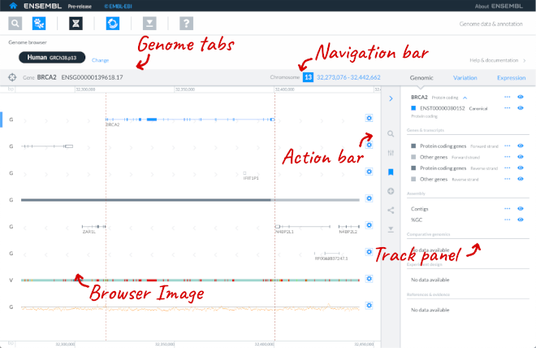

# What is the genome browser?

The genome browser displays a genomic region of interest. There are five parts to this page:
* Browser image
* Navigation bar
* Track panel
* Genome tabs
* Action bar

## Browser image

The main part of the page is the browser image, showing your region or entity of interest and tracks of the genomic features within that region, with the genome shown horizontally. If you have gone to the genome browser by searching for a gene or other entity, this will be highlighted as your focus entity. 

Tracks are sets of data that can be plotted against the genome, such as transcripts, genetic variation or conserved regions. You can change which tracks you can see or the appearance of the tracks using the [Track panel or the cog icons in the browser image](tracks.md).

You can [navigate around this region](navigation.md) using the Navigation bar above it or by mouse scrolling. You can click on features in the tracks to learn more about them and go to the [Entity viewer app](../entity-viewer/entity-viewer.md).

## Navigation bar

You can see the genome coordinates of your region of interest in the Navigation bar. If you have a [Focus entity](focus_entity.md), details of this will be displayed too. You can expand the [Navigation bar to change your region](navigation.md).

## Track panel

The track panel lists all available tracks that can be viewed in the browser. You can use the panel to [show or hide tracks](tracks.md) and learn more about the data.

## Genome tabs

The Genome tabs display the genomes you have chosen to look at using the [Species Selector app](../species-selector/species-selector.md), which may include multiple genomes of the same species. The genome you are currently using is shown in black. You can click on other genomes to see regions of interest in these genomes. When you navigate to another genome, the region and track configuration set on this genome will be held in state until you return to it.

## Action bar

The Action bar gives you options to search and manage tracks, view bookmarks, add your own data, share the view and download data.
