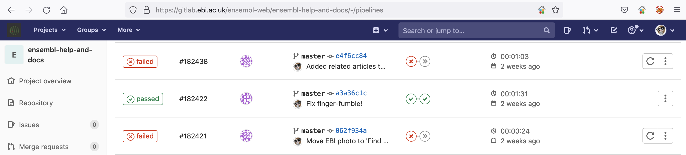
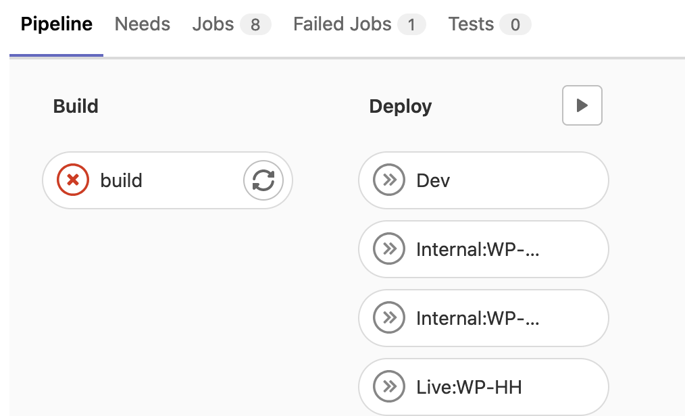
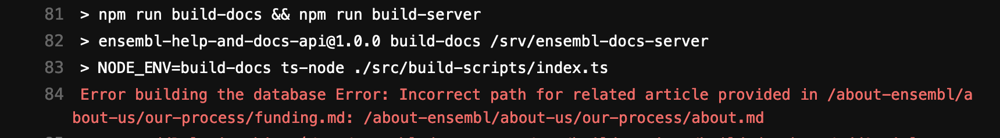

# Using GitHub and previewing your pages

At the moment we have no way to preview pages - everything pushed to master will go live. We are in the process of setting up a system to allow previews, but in the meantime here is an overview of how our continuous integration service works.

## GitHub and GitLab

While the repository is hosted on the public GitHub website, there is also a git-based site internal to the EBI, at https://gitlab.ebi.ac.uk. If you are an EBI employee, you can log into this site using your usual credentials.

We leverage the power of GitLab as follows (this is highly simplified!):

1. GitLab constantly monitors `github.com/Ensembl/ensembl-website-help-and-docs` for commits to master. When one is detected, it is copied from GitHub to GitLab.
1. Once the commit is downloaded, it triggers the build process, compiling the pages into HTML and adding navigation
  - If the build fails, the new build is thrown away and GitLab waits for the next update
  - If it succeeds, the new build is made available to the web frontend

At the moment, the only way to check the build status is by manually checking the [pipelines page on GitLab](https://gitlab.ebi.ac.uk/ensembl-web/ensembl-help-and-docs/-/pipelines).

Click on a red "failed" button to go to that specific run:

then click on the "build" button to see full details:

There will be a long, scary-looking report - ignore everything except the first line of red text, which will tell you exactly which file broke the build, and why.

**Future work** - GitLab can inform GitHub of the status of the latest build, so that GitHub displays either a red cross or a green tick, as per the image below (from the ensembl-client repo). Clicking on the link will take you straight to GitLab.

## Creating branches

At the moment, we encourage content providers to use a feature branch to commit their changes, so that they can be reviewed by a web team member before merging into master.

## Staging site

Our plan is to set up a separate VM where content editors can preview changes before they are merged to master. This will reduce the need for manual reviewing of content and allow you to develop new content more easily!
