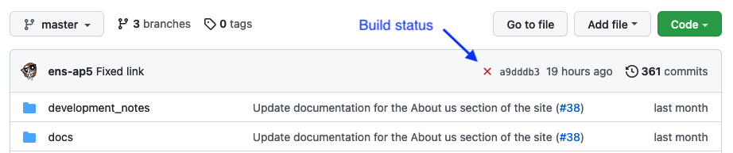

# Using GitHub and previewing your pages

## Creating branches

We encourage content providers to use a feature branch to commit their changes, so that they can be reviewed before merging into master. This saves a lot of time and effort with failed builds, and allows content to be worked on and saved to GitHub before it is ready for publication.

### Previewing your work

If you want to see your new content as it will actually appear on the web, you will need to use a review deployment on our Kubernetes cluster. At the moment these review sites have to be set up manually, so please ask the webteam if you want to take advantage of this service. 

Once your review deployment is set up, all you need to do is push any changes to GitHub and they will be automatically picked up by our CI/CD pipeline and appear on the review site. If your local changes fail to appear on the review site after pushing, the pipeline interface can help you to pinpoint the problem.  

## GitHub

First, go to the [home page of this repository](https://github.com/Ensembl/ensembl-website-help-and-docs). There you will see either a red cross or a green tick, depending on the status of the most recent build on GitLab. 

If the icon is a green tick, everything went fine. If it's a red cross, there was something wrong with one of your updates and the build failed.

Click on the red cross - this will take you to the [pipelines page on GitLab](https://gitlab.ebi.ac.uk/ensembl-web/ensembl-help-and-docs/-/pipelines). Use the instructions below to get to the build report and find which file has the error in it.

## GitLab

While the Ensembl repositories are hosted on the public GitHub website, there is also a git-based site internal to the EBI, at https://gitlab.ebi.ac.uk. If you are an EBI employee, you can log into this site using your usual credentials.

We leverage the power of GitLab as follows (this is highly simplified!):

1. GitLab constantly monitors `github.com/Ensembl/ensembl-website-help-and-docs` for commits to master and any review branches that have been configured. When one is detected, it is copied from GitHub to GitLab.
1. Once the commit is downloaded, it triggers the build process, compiling the pages into HTML and adding navigation
  - If the build fails, the new build is thrown away and GitLab waits for the next update
  - If it succeeds, the new build is made available to the web frontend

Click on a red "failed" button to go to that specific run:

then click on the "build" button to see full details:

There will be a long, scary-looking report - ignore everything except the first line of red text, which will tell you exactly which file broke the build, and why.

Here you can see that the error was in `funding.md`, and that it was a broken link to the `about.md` page.

