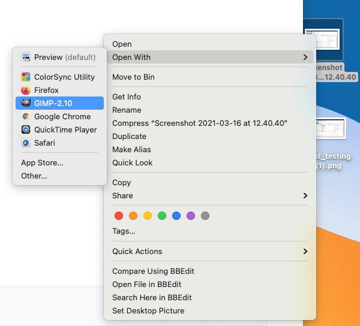
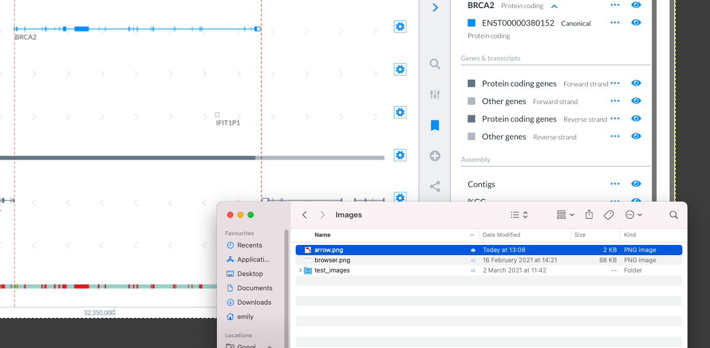
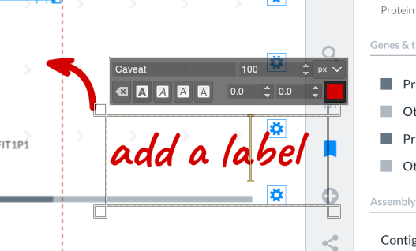
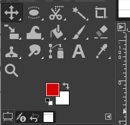
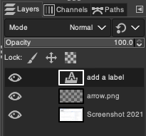
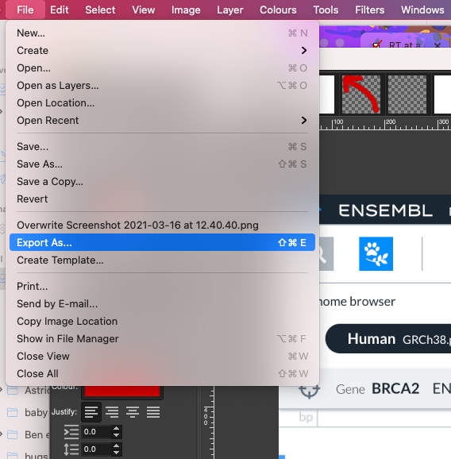
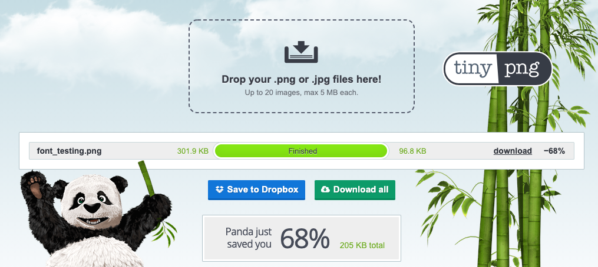

# How to add images to documentation

- [How to create images for Ensembl](#how-to-create-images-for-ensembl)
- [How to add images to documentation](#how-to-add-images-to-documentation)

## How to create images for Ensembl

**When adding images, please remember:**
- the image should not be huge
- the image should be compressed; pass the image through [https://tinypng.com](https://tinypng.com) to compress it
- a good rule of thumb is, if an image is over 100kB, it's probably too much

### Screenshots

#### Whole page

To take images of a whole page, scale your browser to 1200 px wide (you may need to turn on developer tools to see the size of the page) on your laptop retina display screen and take a screenshot (due to the retina display, this image will actually be 2400px).

Open in [GIMP](https://www.gimp.org/).

Drop the arrow.png image into the screenshot wherever you want to add a label – flip/rotate to the orientation you need it at.

Add text labels in Caveat bold 80px #D90000 (rgb 217,0,0).

The tools for Gimp are at the top left, you will mainly need to Move and text tools.

Gimp works with layers, which are listed on the right.

Save the Gimp file to the [Outreach shared drive image folder](https://drive.google.com/drive/folders/1-6m7xzXevV45AiQjeZLLuOQRlAzFgJrF?usp=sharing) so that it can be edited in future. Export the image as png.

Drop the file into [Tinypng](https://tinypng.com/) to compress. A good rule of thumb is, if an image is over 100kB, it's probably too much

Download the image again and add to Git.

#### Zoomed-in sections

Any image that is less than 980 px wide will not be scaled to fit into the pages. To make the text appear that the same size as in the full page images, use size 33 font for labels. For anything in between 980 and 2400 wide, the ratio of font size to image width should be 1/30.

## How to add images to documentation

Images should be stored in a subfolder alongside the Markdown file. For consistency, we use the name `media` for image folders. If one does not exist in the folder you want to put your Markdown file in, go ahead and create it.

Example: ``. (The alt text block can also be empty: ``).